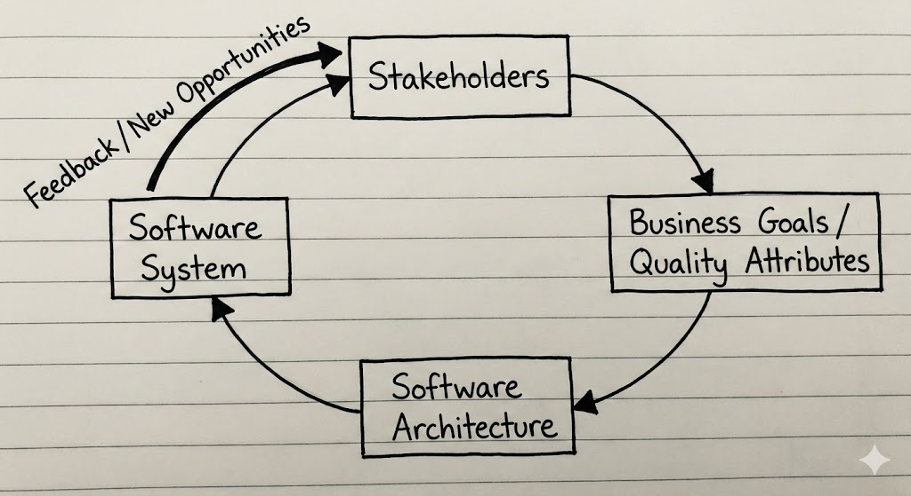
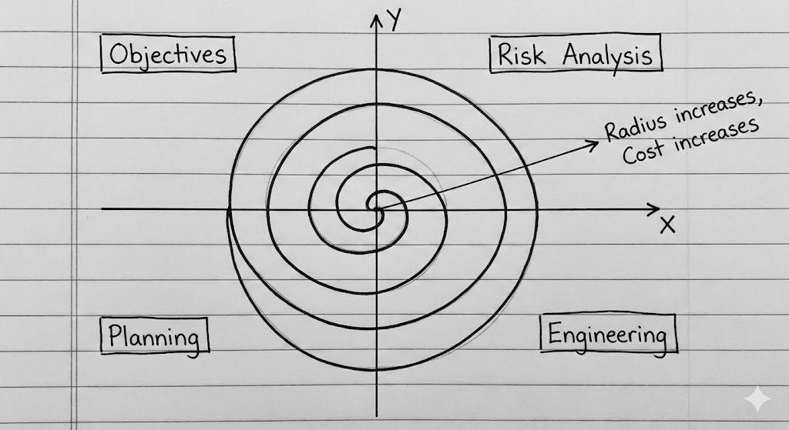
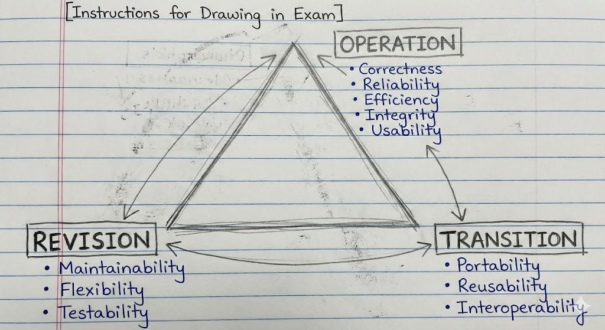

# **UNIT 1: FUNDAMENTALS OF SOFTWARE ARCHITECTURE**

*(Complete Study Material)*

---

### **Q1. What is Software Architecture? How does it represent a System's earliest set of design decisions?**

*(Repeated: Nov 2023)*

#### **1. Comprehensive Definition**

**Software Architecture** ek software system ka fundamental structural organization hota hai. Ye ek blueprint hota hai jo define karta hai:

* **Components:** Computational units (e.g., Databases, Servers, Classes).
* **Connectors:** Interaction ke pathways (e.g., API calls, Network Protocols).
* **Constraints:** Rules jo batate hain ki ye sab ek saath kaise fit hote hain.
* **Rationale:** Reasoning ki *kyun* structure aise build kiya gaya hai.

**The "High-Level" Rule:** Architecture “Important Stuff” ke baare me hota hai. Jo bhi performance, security, ya reliability ko affect kare — wo architectural decision hota hai. Ek button ka color *design* hota hai, lekin button ke code ko database code se separate rakhna *architecture* hota hai.

#### **2. Why Architecture = Earliest Design Decisions?**

Software Architecture un pehle decisions ka set hota hai jo baad me **change karna sabse mushkil** hota hai.

1. **Fundamental Structure:** Agar tumne decide kar liya ki system “Client-Server” hoga, to project ke beech me “Peer-to-Peer” me shift karna aasaan nahi hota. 90% code rewrite karna pad sakta hai.
2. **Resource Allocation:** Architecture decide karta hai kaunsi team kya karegi. (e.g., "Team A Database legi, Team B UI").
3. **Quality Attributes:** Yaha liye gaye decisions decide karte hain ki system fast hoga (Performance) ya safe hoga (Security). Security ko end me add nahi kar sakte — ye start se architect karna padta hai.

#### **3. Software Components and Connectors (C&C)**

*(Short Note Topic)*
Architecture ka sabse basic view hota hai **C&C View**.

* **Components (Boxes):** Ye woh elements hain jo *kaam* karte hain (Processing/Storage).

  * *Examples:* Client, Server, Database, Filter, Object.
* **Connectors (Lines):** Ye woh elements hain jo communication *facilitate* karte hain.

  * *Examples:* Procedure Calls, HTTP Requests, SQL Queries, Pipes.

**[Diagram: Components & Connectors]**
*Do boxes banao jinke labels “Component A” aur “Component B” hon, aur unhe ek line (Connector) se jodo.*

---

### **Q2. The Architecture Business Cycle (ABC)**

*(Repeated: Dec 2024)*

#### **1. Conceptual Definition**

**Architecture Business Cycle (ABC)** ek feedback loop hai jo explain karta hai ki business goals aur technical architecture ka relation kya hota hai. Ye prove karta hai ki architecture vacuum me create nahi hota—ye business ki needs ka result hota hai, aur aage chal kar new business opportunities bhi create karta hai.

#### **2. The Cycle Steps (The Loop)**

Cycle ek circle me flow hoti hai. Tumhe in 5 steps ko order me explain karna hota hai:

1. **Stakeholders & Business Goals (Input):**

   * Cycle shuru hoti hai logon se (CEO, Marketing Team, End Users).
   * Ye goals define karte hain: "Hume secure banking app chahiye" ya "Hume fast video site chahiye."
2. **Quality Attributes:**

   * Architect business goals ko technical requirements me convert karta hai.
   * *Goal:* "Secure App" → *Attribute:* "High Encryption & Authentication."
3. **Software Architecture:**

   * Architect ek structure banata hai (e.g., Layered Architecture) jo attributes ko satisfy kare.
4. **The System:**

   * Developers architecture ke basis par actual software banate hain.
5. **Feedback (Return):**

   * System live hone ke baad ye business ko change karta hai.
   * *Example:* Amazon ne strong Cloud Architecture (AWS) banaya, phir unhe realize hua ki ise bech bhi sakte hain. Ye ek **New Business Goal** bana, aur cycle fir se start ho gayi.

#### **3. Architecture Diagram: The ABC Loop**

---

### **Q3. The Spiral Model of Software Development**

*(Repeated: Nov 2022)*

#### **1. Conceptual Definition**

**Spiral Model** ek **Risk-Driven** process model generator hai. Barry Boehm ne isse introduce kiya tha. Waterfall model assume karta hai ki sab perfect chalega, lekin Spiral model assume karta hai ki problems aayengi, aur isliye risks ko early identify karna zaroori hai.

* **Structure:** Ye Prototyping ki iterative nature ko Waterfall ki systematic control ke saath combine karta hai.

#### **2. The Four Quadrants (Phases)**

Development ek spiral me move karta hai, har baar 4 quadrants se guzarta hua:

1. **Quadrant 1: Determine Objectives:**

   * Is cycle ke goals define karo.
   * Constraints identify karo (Budget, Schedule).
2. **Quadrant 2: Identify and Resolve Risks (Key Phase):**

   * Alternatives analyze karo.
   * **Prototype banao:** Ye bahut crucial hai. Full code likhne se pehle ek small version banao jo idea test kare. Agar risk high ho to project ruk sakta hai.
3. **Quadrant 3: Development and Test:**

   * Is cycle ka actual code likho.
   * Testing karo (Unit, Integration).
4. **Quadrant 4: Plan Next Iteration:**

   * Client ke saath progress review karo.
   * Next loop ke features plan karo.

#### **3. Architecture Diagram: The Spiral**

#### **4. Advantages vs Disadvantages**

| Advantages                                                  | Disadvantages                                            |
| :---------------------------------------------------------- | :------------------------------------------------------- |
| **Risk Handling:** High-risk projects ke liye best model.   | **Complexity:** Waterfall se zyada complex manage karna. |
| **Early Feedback:** Users early prototypes dekh sakte hain. | **Cost:** Small projects ke liye expensive.              |
| **Flexibility:** Changes aasani se accommodate hote hain.   | **Expertise:** Risk analysis experts ki zarurat.         |

---

### **Q4. McCall’s Software Quality Model**

*(Repeated: Nov 2023)*

#### **1. Conceptual Definition**

**McCall’s Quality Model** (1977) quality ko sirf “No Bugs” nahi maanta, balki 11 distinct factors ke set ke roop me define karta hai. In factors ko product lifecycle ke basis par **Three Categories** me group kiya gaya hai.

#### **2. The Three Categories (Memorize "P-T-R")**

**A. Product Revision (Can I change it?)**

* Ye perspective software ki adaptability ko deal karta hai.

  1. **Maintainability:** Bug find aur fix karna kitna easy hai?
  2. **Flexibility:** New feature add karna kitna easy hai?
  3. **Testability:** Software ka verification kitna easy hai?

**B. Product Transition (Can I move it?)**

* Ye perspective software ko new environments me move karne se deal karta hai.

  1. **Portability:** Kya ye Windows, Mac, Linux sab par chal sakta hai?
  2. **Reusability:** Kya “Login Module” ko kisi aur app me reuse kar sakte ho?
  3. **Interoperability:** Kya ye dusre systems (jaise Bank API) ke saath data exchange kar sakta hai?

**C. Product Operations (Does it work?)**

* Ye perspective software ke daily usage se related hota hai.

  1. **Correctness:** Kya software wahi karta hai jo user chahta hai?
  2. **Reliability:** Kya ye bina crash hue run hota hai?
  3. **Efficiency:** Kya ye minimum CPU/RAM use karta hai?
  4. **Integrity (Security):** Kya ye hackers se safe hai?
  5. **Usability:** Kya ye learn aur use karna easy hai?

#### **3. Architecture Diagram: The Quality Triangle**

---

### **Q5. Various Models of Software Development (Comparison)**

*(Repeated: Dec 2024)*

*Kyuki question “Various Models” bolta hai, to Spiral ko Waterfall aur Agile ke saath briefly compare karo.*

**1. The Waterfall Model (Linear)**

* **Concept:** Strict sequential model. Requirements → Design → Code → Test.
* **Issue:** Tum wapas nahi ja sakte. Agar Testing me error mil jaye, Requirements fix karna expensive hota hai.
* **Best for:** Simple, stable projects.

**2. The Agile Model (Iterative)**

* **Concept:** Product ko small “Sprints” (2–4 weeks) me tod deta hai. Working software frequently deliver hota hai.
* **Issue:** Final cost ya timeline predict karna mushkil hota hai kyuki scope constantly change hota rehta hai.
* **Best for:** Web apps, Startups, changing requirements.

**3. The Spiral Model (Risk-Based)**

* **Concept:** Repeated cycles of risk analysis and prototyping.
* **Issue:** Expensive aur complex.
* **Best for:** Large, high-risk systems (NASA, Banking).

---

