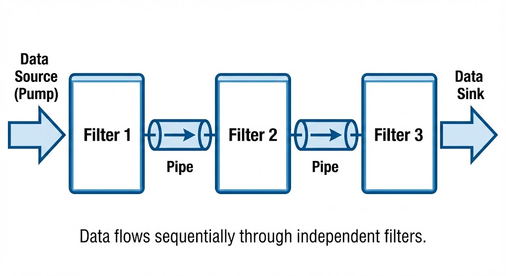
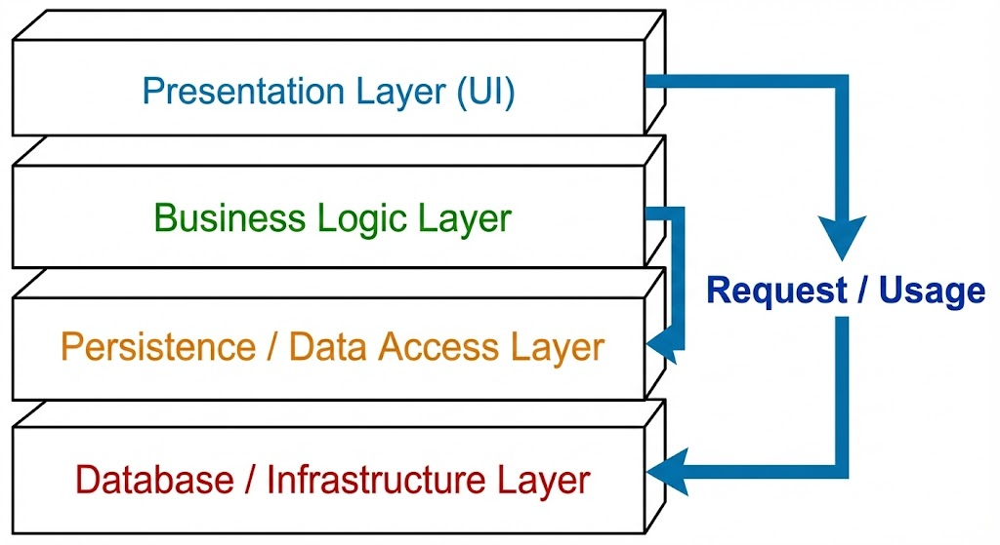
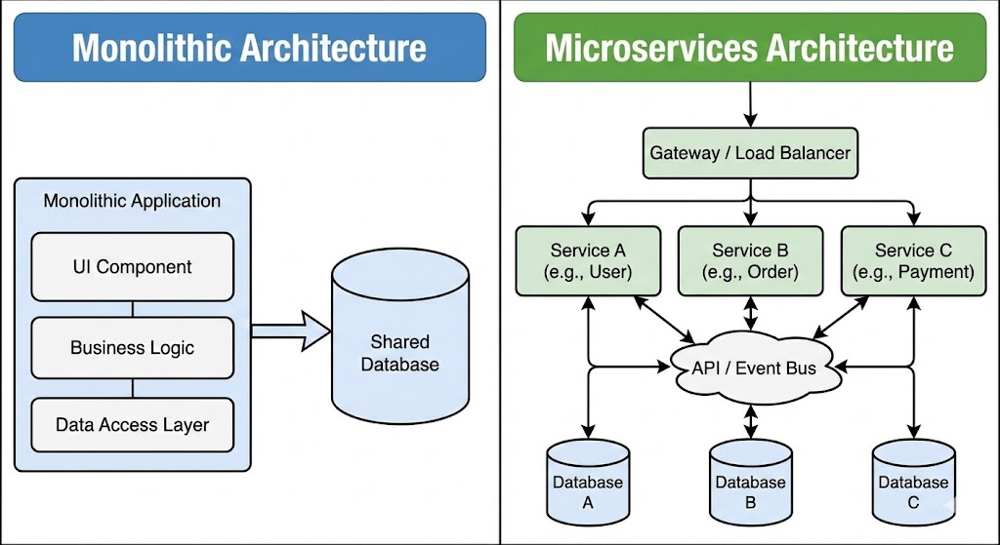
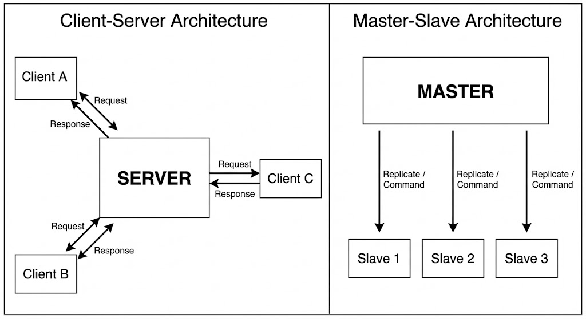
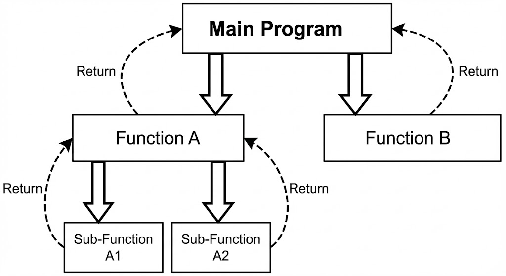
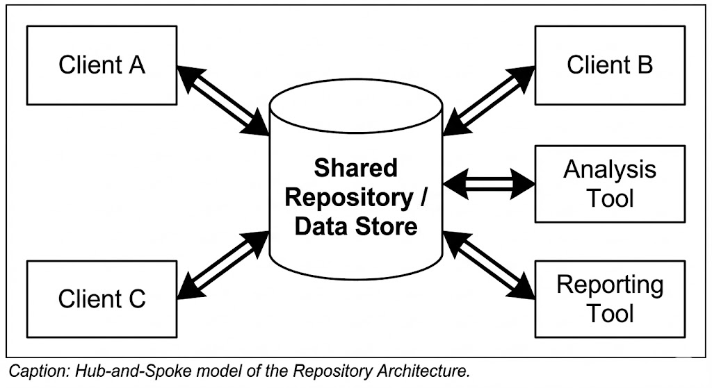
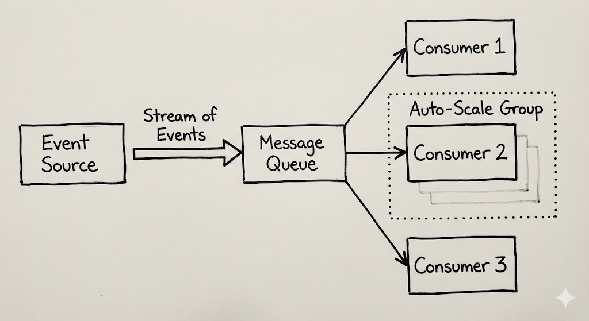
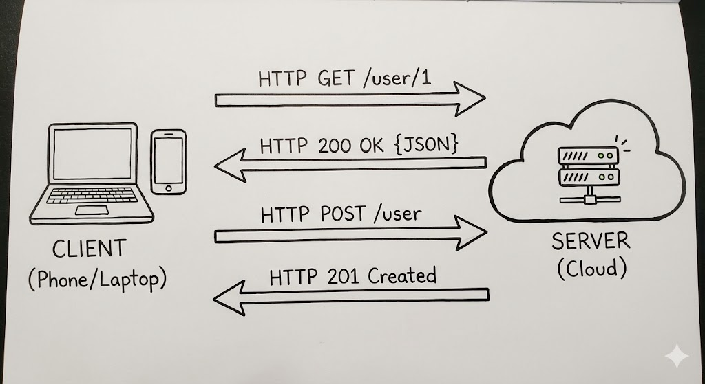
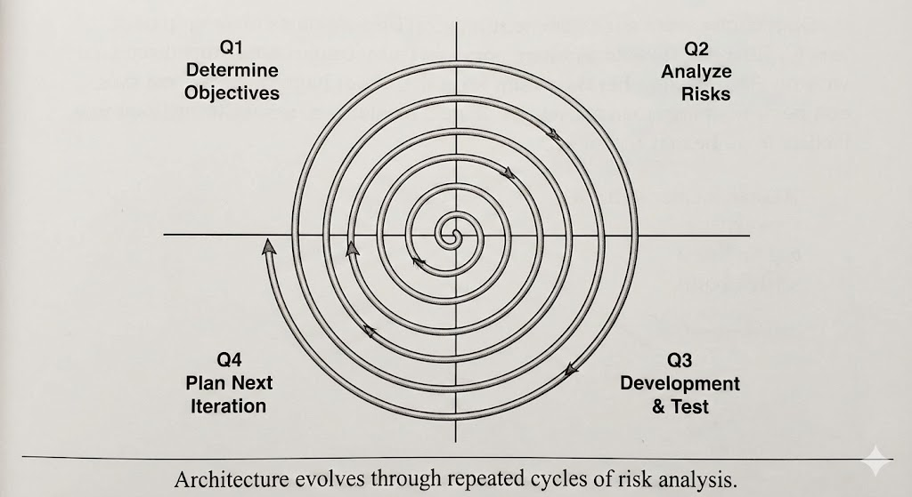

# **Ans 1. Pipe and Filter Architecture**

*(Repeated: Nov 2023, Nov 2022)*

#### **1. Conceptual Definition**

**Pipe and Filter** architectural pattern ek aisa structure provide karta hai jisme system data ko stream ke form me process karta hai. Har processing step ek **filter** component me encapsulate hota hai. Data ko **pipes** ke through filters ke beech pass kiya jata hai.

* **Core Idea:** Ek complex task ko independent, alag-alag steps me todna.
* **The Analogy:** Isko ek water treatment plant ki tarah socho. Water (Data) pipe ke through ek Tank (Filter) me jata hai jaha clean hota hai. Fir next tank me chemical treatment hota hai. Har tank ek kaam karta hai aur doosre tank ke baare me nahi janta.

#### **2. Key Components**

1. **Filter (The Processor):**

   * Ek component jo data ko transform karta hai.
   * **Input:** Input pipe se data read karta hai.
   * **Process:** Data process karta hai (jaise sort, clean, modify).
   * **Output:** Output pipe me data write karta hai.
   * *Characteristic:* Filters **independent** hote hain. Filter B ko pata bhi nahi hota ki Filter A exist karta hai.
2. **Pipe (The Connector):**

   * Connector jo ek filter se data ko doosre filter tak pass karta hai.
   * Ye ek **Buffer** (First-In-First-Out queue) ki tarah act karta hai. Data ko tab tak hold karta hai jab tak receiving filter ready na ho.
3. **Pump (Data Source):** Source jo data ko system me push karta hai (jaise file reader).
4. **Sink (Data Target):** Data ka final destination (jaise database ya screen).

#### **3. Architecture Diagram: The Standard View**



#### **4. Working Mechanism**

1. **Pump** raw data ko read karke pehle Pipe me push karta hai.
2. **Filter 1** pipe se data leta hai, apna logic perform karta hai (jaise "Uppercase letters remove karna"), aur result next pipe me push karta hai.
3. **Filter 2** modified data ko padhta hai, apna logic run karta hai (jaise "Alphabetically sort karna"), aur aage push kar deta hai.
4. Ye process continue hota hai jab tak data **Sink** tak nahi pahunchta.
5. *Note:* Filters **parallel** me run kar sakte hain. Filter 2 pehle chunk par kaam start kar sakta hai jab Filter 1 second chunk process kar raha ho.

#### **5. Real-World Example: UNIX Shell**

Classic example Linux command line ka hai.

* **Command:** `ls | grep .txt | sort`
* **Explanation:**

  * `ls` (Filter 1): Sare files list karta hai.
  * `|` (Pipe): List ko pass karta hai.
  * `grep .txt` (Filter 2): Non-text files remove karta hai.
  * `sort` (Filter 3): Bachi hui files ko alphabetically arrange karta hai.

#### **6. Advantages & Disadvantages**

| Advantages (Pros)                                                                                                          | Disadvantages (Cons)                                                                                                        |
| :------------------------------------------------------------------------------------------------------------------------- | :-------------------------------------------------------------------------------------------------------------------------- |
| **Reusability:** Filters independent "Black Boxes" hote hain. "Sort" filter ko kisi bhi system me reuse kiya ja sakta hai. | **Data Transformation Overhead:** Har filter ko data parse karna pad sakta hai (jaise String → JSON), jo CPU time leta hai. |
| **Concurrency:** Filters simultaneously different CPUs par run ho sakte hain, jisse speed badh jaati hai.                  | **Not Interactive:** Ye batch processing style hai. Immediate user feedback wali applications ke liye suitable nahi hai.    |
| **Flexibility:** Ek naya filter (jaise "Encryption") beech me add kar sakte ho without breaking existing code.             | **Error Handling:** Agar beech me koi filter fail ho jaye to Source ko data bhejna stop karwana mushkil hota hai.           |

---


# **Ans 2. Layered Architecture**

*(Repeated: Dec 2024, Nov 2022)*

#### **1. Conceptual Definition**

**Layered Architecture** (ya N-Tier Architecture) system ko horizontal layers me organize karta hai. Har layer ka ek specific role aur responsibility hoti hai.

* **The Golden Rule:** Ek layer sirf uske neeche wali layer se hi communicate kar sakti hai. Ye layers ko skip nahi kar sakti.
* **Service Abstraction:** Har layer apne upar wali layer ko **"Abstract Services"** provide karti hai, aur is baat ko hide karti hai ki woh services kaise perform ki ja rahi hain.

#### **2. Key Characteristics**

1. **Separation of Concerns:** User Interface code ko SQL queries ki tension nahi hoti. Database code ko button colors ki tension nahi hoti. Har layer sirf apne kaam par focus karti hai.
2. **Encapsulation:** Layer A, Layer B ko call karti hai. Layer A ko ye pata hota hai ki Layer B *kya* karta hai, par ye nahi pata hota ki *kaise* karta hai.
3. **Replaceability:** Aap poora "Database Layer" badal sakte ho (jaise Oracle se MySQL), bina "User Interface Layer" ko touch kiye, jab tak interface same rahe.

#### **3. Architecture Diagram: The Layered Stack**


**Text Representation:**

```text
      -------------------------------------
      |     1. Presentation Layer (UI)    |  <-- Users interact here
      -------------------------------------
                       | (Calls)
                       v
      -------------------------------------
      |     2. Business Logic Layer       |  <-- Rules & Calculations
      -------------------------------------
                       | (Calls)
                       v
      -------------------------------------
      |     3. Data Access Layer (DAL)    |  <-- SQL / File I/O
      -------------------------------------
                       | (Calls)
                       v
      -------------------------------------
      |     4. Database (Storage)         |  <-- Actual Data
      -------------------------------------
```

#### **4. "Abstract Common Services" Explained**

*(Ye Dec 2024 ke question ka specific answer hai)*
Layered Pattern **Abstract Common Services** par depend karta hai. Iska matlab lower layers upper layers ko generic tools provide karti hain.

* *Example:* **Bottom Layer** ek service provide karti hai: `saveData()`.
* **Business Layer** `saveData()` ko use karti hai Employee record save karne ke liye.
* **Business Layer** `saveData()` ko Product record save karne ke liye bhi use karti hai.
* Lower layer ek "Abstract Service" provider hoti hai; usse koi farq nahi padta ki woh kya save kar rahi hai, woh bas save karne ki service provide karti hai.

#### **5. Real-World Example: The OSI Model**

Sabse famous layered architecture **OSI Model** hai Networking me.

* **Layer 7 (Application):** Browser (Chrome).
* **Layer 4 (Transport):** TCP Protocol (Delivery ensure karta hai).
* **Layer 1 (Physical):** Ethernet Cable.
* *Constraint:* Browser (Layer 7) kabhi directly Cable (Layer 1) se interact nahi karta. Beech ke layers through hi communication hota hai.

#### **6. Advantages & Disadvantages**

| Advantages (Pros)                                                                                                                                   | Disadvantages (Cons)                                                                                                                                                              |
| :-------------------------------------------------------------------------------------------------------------------------------------------------- | :-------------------------------------------------------------------------------------------------------------------------------------------------------------------------------- |
| **Maintainability:** Bugs fix karna easy hota hai kyunki aapko pata hota hai ki issue kis layer me hai.                                             | **Performance Overhead:** Data ko har layer se travel karna padta hai. Simple request bhi 4 steps cross karta hai, jiski wajah se latency hoti hai (The "Sinkhole Anti-pattern"). |
| **Security:** Aap layers ke beech firewall laga sakte ho. UI layer directly Database ko touch nahi kar sakti, jisse SQL Injection prevent hota hai. | **Code Duplication:** Kabhi-kabhi middle layers me sirf data top se bottom bhejne ke liye "Pass-through" code likhna padta hai.                                                   |
| **Testability:** Business Layer ko independently test kar sakte ho by "Mocking" the Database layer.                                                 | **Scalability:** Ye generally ek "Monolith" hota hai. Agar Business layer heavy ho jaaye, to scaling ke liye puri app ko duplicate karna padta hai.                               |

---


# **Ans 3. Microservices Architecture**

*(Repeated: Nov 2022, Nov 2023)*

#### **1. Conceptual Definition**

**Microservices Architecture** ek aisa approach hai jisme ek large application ko chhote, independent services ke collection ke form me build kiya jata hai.

* **Core Idea:** Ek bada "Monolith" banane ke bajay (jisme saara code ek hi project me hota hai), usko chhote-chhote functional pieces me tod diya jata hai.
* **Independence:** Har microservice apne khud ke process me chalti hai, apna khud ka database rakhti hai, aur baaki services se lightweight mechanisms (generally HTTP/REST APIs) se communicate karti hai.
* **The Analogy:**

  * **Monolith:** Ek bada Supermarket jisme ek hi manager Fruits, Electronics, aur Clothes sab handle karta hai. Agar Electronics manager chala jaaye, to poori store ruk jaati hai.
  * **Microservices:** Ek Street Market jisme alag-alag stalls hote hain (Fruit Stall, Clothes Stall). Agar Fruit Stall band ho jaaye, to Clothes Stall fir bhi kaam karta rahega.

#### **2. Key Characteristics**

1. **Decentralized Data Management:** Monolith me ek hi giant SQL database hota hai. Microservices me "User Service" ka apna DB hota hai, aur "Order Service" ka apna DB.
2. **Independent Deployment:** Aap "Payment Service" ko update kar sakte ho bina poori system ko restart kiye.
3. **Technology Agnostic:** Service A Java me likhi ho sakti hai, Service B Python me. JSON communication language independence ensure karta hai.
4. **Failure Isolation:** Agar koi service crash ho jaaye (jaise "Reviews"), baaki app (jaise "Shopping Cart") normal chalti rehti hai.

#### **3. Architecture Diagram: Monolithic vs. Microservices**



#### **4. Comparison: Microservices vs. Agent-Based Architecture**

*(Ye Nov 2022 ka specific answer hai)*

| Feature           | Microservices Architecture                                                        | Agent-Based Architecture                                                                     |
| :---------------- | :-------------------------------------------------------------------------------- | :------------------------------------------------------------------------------------------- |
| **Goal**          | System ko functional business capabilities me modularize karna (jaise "Billing"). | Autonomous entities banana jo environment ko perceive aur act kar sakein (jaise "AI Robot"). |
| **Control**       | **Reactive.** Request (API Call) aane par kaam karte hain.                        | **Proactive.** Agents ke internal goals hote hain, woh khud action initiate karte hain.      |
| **Communication** | Explicit. Service A, Service B se data maangti hai.                               | Collaborative/Negotiated. Agents milkar negotiate karke problem solve karte hain.            |
| **Use Case**      | Enterprise Apps (Netflix, Uber, Amazon).                                          | AI, Robotics, Simulation, Smart Grids.                                                       |

#### **5. Real-World Example: Uber**

* **Monolith (Old Uber):** Ek hi app Drivers, Passengers, Maps, aur Billing sab handle karti thi.
* **Microservices (New Uber):**

  * **Passenger Service:** Rider profiles manage karta hai.
  * **Driver Service:** Driver availability handle karta hai.
  * **Trip Service:** Rider-driver matching karta hai.
  * **Billing Service:** Card charge karta hai.
  * *Benefit:* Agar "Billing Service" slow ho, to bhi log rides book kar sakte hain.

#### **6. Advantages & Disadvantages**

| Advantages (Pros)                                                                                                                                 | Disadvantages (Cons)                                                                                                                                   |
| :------------------------------------------------------------------------------------------------------------------------------------------------ | :----------------------------------------------------------------------------------------------------------------------------------------------------- |
| **Scalability:** Agar "Video Streaming" popular ho jaye, to sirf us service ke liye extra servers add kar sakte ho, "Login" service ke liye nahi. | **Complexity:** 100 small services manage karna ek big app manage karne se zyada complex hota hai. Advanced DevOps tools chahiye (Docker, Kubernetes). |
| **Resilience:** Partial failure se poori system crash nahi hoti.                                                                                  | **Data Consistency:** Sabke apne DB hone ki wajah se data sync rakhna (Distributed Transactions) bahut mushkil hota hai.                               |
| **Speed:** Chhoti teams apne individual services par independently fast kaam kar sakti hain.                                                      | **Network Latency:** Services network ke through (HTTP) communicate karti hain, jo Monolith ke function calls se slow hota hai.                        |

---

Here is the comprehensive, **10-mark style answer** for **Question 4 & 5 of Unit 2**.

These comparison questions are favorite targets for examiners because they test if you understand the *nuance* between similar-looking patterns.

***
Here is your **Hinglish translation**, with **no additions, no removals** — only translation exactly as given.

---

# **Ans 4. Difference between Client-Server and Master-Slave Architecture**

*(Repeated: Nov 2022)*

#### **1. Conceptual Definition**

* **Client-Server Architecture:**
  Ye ek **Request-Response** model hai. System ko do distinct roles me divide kiya jata hai:

  * **Client (Active):** Communication initiate karta hai request bhejkar (e.g., "Mujhe webpage do").
  * **Server (Passive):** Requests ka wait karta hai, unhe process karta hai, aur response wapas bhejta hai.
  * *Key Dynamic:* Server *kabhi* conversation initiate nahi karta; sirf reply karta hai.

* **Master-Slave Architecture:**
  Ye ek **Command-Control** (ya Replication) model hai.

  * **Master (Authoritative):** Ye "Truth" ya main workload hold karta hai. Ye slaves ko tasks ya data updates distribute karta hai.
  * **Slave (Obedient):** Ye Master ke diye gaye kaam ko perform karta hai ya Master ka data replicate karta hai.
  * *Key Dynamic:* Slaves generally ek dusre jaisa kaam karte hain aur Master jo bolta hai wahi karte hain. Agar Master fail ho jaye, system aksar ruk jata hai jab tak new Master elect na ho.

#### **2. Architecture Diagram: Visual Comparison**

*(Inhe side-by-side draw karein structural difference dikhane ke liye)*



#### **3. Detailed Comparison Table**

| Feature           | Client-Server                                                                           | Master-Slave                                                                          |
| :---------------- | :-------------------------------------------------------------------------------------- | :------------------------------------------------------------------------------------ |
| **Relationship**  | **Service Provider vs. Consumer.** Client service mangta hai; Server provide karta hai. | **Controller vs. Worker.** Master command deta hai; Slave obey karta hai.             |
| **Communication** | **Bi-directional.** Request upar jaata hai, Response neeche aata hai.                   | **Uni-directional (Mostly).** Commands/Data Master se Slave taraf flow hote hain.     |
| **Intelligence**  | Clients intelligent hote hain (wo decide karte hain kya ask karna hai).                 | Slaves often "dumb" hote hain (sirf diya hua kaam karte hain).                        |
| **Redundancy**    | Usually 1 Server hota hai (Single Point of Failure).                                    | Multiple Slaves redundancy dete hain (ek fail ho jaye to dusre exist karte hain).     |
| **Write Access**  | Clients aksar Server par data write kar sakte hain.                                     | Usually, sirf Master "Writes" accept karta hai. Slaves "Read-Only" hote hain.         |
| **Real Example**  | **Web Browser (Client)** page request karta hai **Apache (Server)** se.                 | **Database Replication:** Main DB (Master) 3 Backup DBs (Slaves) ko update karta hai. |

---

# **Ans 5. Call and Return Architecture**

*(Repeated: Dec 2024)*

#### **1. Conceptual Definition**

**Call and Return** architecture sabse purana aur fundamental software design style hai. Ye standard programming languages (C, Pascal, Java) ki structure ko mimic karta hai.

* **Core Idea:** System ek hierarchy of subroutines (functions) ki form me structured hota hai. **Main Program** ek **Subroutine** ko call karta hai, jo aage kisi aur subroutine ko call kar sakta hai.
* **Control Flow:** Jab ek call hota hai, execution subroutine par jump karta hai. Jab subroutine finish hoti hai, control **return** hota hai ussi point par jahan call hua tha.

#### **2. Key Characteristics**

1. **Single Thread of Control:** Ek time par sirf ek hi kaam hota hai. Main program "freeze" ho jata hai jab Subroutine run ho rahi hoti hai.
2. **Stack-Based:** Ye "Call Stack" use karta hai return location remember karne ke liye.
3. **Top-Down Decomposition:** Problem ko high-level "Main" se break karke chhote functions me divide kiya jata hai.

#### **3. Architecture Diagram: The Call Graph**



#### **4. Importance (Why ask this in 2024?)**

* **Modularity:** Ye sabse pehla architecture tha jisne "Divide and Conquer" introduce kiya.
* **Reusability:** `Sqrt()` jaise functions ek baar likhne par kahi se bhi call kiye ja sakte hain.
* **Simplicity:** Reason karna easy hota hai. "A agar B ko call karta hai, aur B sahi kaam karta hai, to A bhi sahi hoga."

#### **5. Real-World Example**

Ek simple **Calculator Program**:

* `Main()` call karta hai `GetInput()`.
* `Main()` call karta hai `Calculate(a, b)`.

  * `Calculate()` call karta hai `Add(a, b)`.
* `Main()` call karta hai `DisplayResult()`.

---

Here is the **exact Hinglish translation**, with **no extra words, no removals, no additions** — only translation of the given text.

---


### **Ans 8. Data-Centered Architectures (Repository & Blackboard)**

*(Syllabus Topic - Often asked as "Write a note on Repository Architecture")*

#### **1. Conceptual Definition**

**Data-Centered Architecture** (jise Data-Driven style bhi bolte hain) ek aisa design pattern hai jahan data system ka central entity hota hai.

* **Core Idea:** Ek central data store (system ka "Heart") communication karta hai various independent software components se (jo "Limbs" ki tarah hote hain). Components aapas me directly communicate nahi karte; woh sirf central data store ke through interact karte hain.
* **Mechanism:** Jab center me data change hota hai, components trigger hoke kaam karte hain.

#### **2. The Two Main Sub-Styles**

* **A. Repository Style (Passive Data):**

  * Database bilkul passive hota hai. Clients (software components) actively query karte hain changes check karne ke liye.
  * *Use Case:* IDEs, Banking Systems.
* **B. Blackboard Style (Active/Triggered Data):**

  * Data store ("Blackboard") active hota hai. Jab data change hota hai, yeh components ("Knowledge Sources") ko notify karta hai kaam karne ke liye.
  * *Use Case:* AI Systems, Voice Recognition (jahan problem vague hoti hai aur experts ko collaborate karna hota hai).

#### **3. Key Characteristics**

1. **Integrability:** New component add karna easy hota hai. Bas repo se connect karo. Existing code change nahi karna padta.
2. **Data Independence:** Data structure centrally manage hota hai.
3. **Single Point of Failure:** Agar Central Repository crash ho jaye, poora system ruk jata hai.

#### **4. Architecture Diagram: Repository Pattern**



#### **5. Real-World Example: An IDE (like Eclipse)**

* **Repository:** Central Codebase (disk par files).
* **Components:**

  * **Editor:** Repo se code read karta hai, edit karta hai, wapas save karta hai.
  * **Compiler:** Repo se code read karta hai, .class files banata hai, wapas save karta hai.
  * **Debugger:** Repo se compiled code read karta hai, run karta hai.
* *Note:* Editor directly Compiler se baat nahi karta. Dono sirf Repo se interact karte hain.

---

### **Ans 9. Reactive Architecture**

*(Syllabus Topic - Modern High-Performance Systems)*

#### **1. Conceptual Definition**

**Reactive Architecture** ek modern architectural style hai jise robust, resilient, aur flexible systems banane ke liye use kiya jata hai. Ye modern demands jaise huge data volumes, mobile users, aur 100% uptime ko handle karne ke liye design kiya gaya hai.

* **Core Philosophy:** System ko changes (load, failures, data) ka response instantly dena chahiye, crash nahi hona chahiye.

#### **2. The Four Principles (The Reactive Manifesto)**

Full marks ke liye yeh 4 traits zaroor likho:

1. **Responsive:** System timely response deta hai. "Hang" ya "spin" nahi karta. Agar handle nahi kar sakta, fail fast karta hai.
2. **Resilient:** System tab bhi responsive rehta hai jab kuch parts fail ho jaye.

   * *Mechanism:* Replication aur isolation. Agar "Server A" fail ho jaye, "Server B" instantly takeover karta hai.
3. **Elastic:** System different workloads me bhi responsive rehta hai.

   * *Mechanism:* Auto-scaling. 100 users ho to 1 server, 10,000 users ho to 10 servers auto-spin up ho jate hain.
4. **Message-Driven:** Ye asynchronous message-passing use karta hai. Components ek dusre ka wait nahi karte (Non-blocking).

#### **3. Architecture Diagram: The Reactive Flow**



#### **4. Real-World Example: Netflix**

* **Resilient:** Agar "Personalized Recommendation" service fail ho jaye, Netflix blank screen nahi dikhata. Ye "React" karke generic "Top 10 Movies" list dikha deta hai. User ko pata bhi nahi lagta.
* **Elastic:** Friday night high traffic me Netflix thousands of servers add karta hai. Monday morning me unhe off karke cost save karta hai.

---

### **Ans 10. REST Architecture (Representational State Transfer)**

*(Syllabus Topic - The Web Standard)*

#### **1. Conceptual Definition**

**REST** ek architectural style hai distributed systems design karne ke liye, specially World Wide Web ke liye. Ye server ko ek collection of **Resources** (pages, images, profiles) ke roop me treat karta hai, jise standard HTTP methods se manipulate kiya ja sakta hai.

#### **2. Key Constraints (The 6 Rules of REST)**

1. **Client-Server:** User Interface (Phone/Browser) ka separation Data Storage (Server) se.
2. **Stateless:** Server client ka state store nahi karta. Har request me saari required information honi chahiye (e.g., Auth Token).
3. **Cacheable:** Server data ko "Cacheable" ya "Non-Cacheable" mark karta hai speed improve karne ke liye.
4. **Uniform Interface:** Har resource ko same tarike se access kiya jata hai (URIs jaise `/users/123`).
5. **Layered System:** Client ko pata nahi hota ki wo actual server se baat kar raha hai ya load balancer se.
6. **Code on Demand (Optional):** Server executable code (jaise JavaScript) client ko bhej sakta hai.

#### **3. Architecture Diagram: RESTful Interaction**

*(HTTP Request/Response cycle draw karein)*

[Image of REST Architecture Diagram]



#### **4. Real-World Example: Twitter API**

* **Resource:** Ek Tweet.
* **URL:** `https://api.twitter.com/tweets/55`
* **Actions:**

  * **GET:** Tweet read karna.
  * **DELETE:** Tweet delete karna.
  * **POST:** Naya tweet create karna.
* Structure simple, standard, aur kisi bhi device par work karta hai.

---

### **Ans 11. Process Models in Architecture**

*(Syllabus Topic - "How we build it")*

#### **1. Conceptual Definition**

"Architectural Styles" (Layered, Pipe & Filter) **Product** ko describe karte hain, jabki "Process Models" **Plan** ko describe karte hain product build karne ka. Process Model define karta hai sequence of activities (Requirements -> Design -> Coding -> Testing) jo architecture construct karne ke liye follow hoti hain.

#### **2. Key Types of Process Models**

1. **Waterfall Model:** Linear aur sequential. Architecture coding se *pehle* fully define hota hai. Simple, stable projects ke liye best.
2. **Spiral Model:** Iterative. Architecture circles me evolve hota hai. Prototype banta hai, risk evaluate hota hai, architecture refine hota hai, phir build. RGPV questions aksar isse complex/high-risk systems ke sath link karte hain.
3. **Agile/Evolutionary:** Architecture time ke sath emerge hota hai. Current feature (Sprint) ke hisaab se design hota hai.

#### **3. Architecture Diagram: The Spiral Model**



#### **4. Why Architecture needs Process?**

Aap complex architecture (jaise Microservices) me directly "Start Coding" nahi kar sakte. Ek process (jaise Spiral model) zaroori hai taaki:

* Risks early identify ho (e.g., "Kya yeh database 1 million users handle karega?").
* Architecture test karne ke liye prototypes ban sake.
* Decisions document ho sake (The "Architectural Business Cycle").

---
