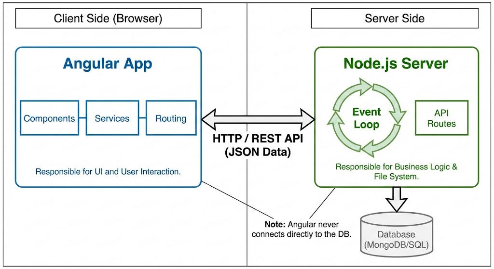
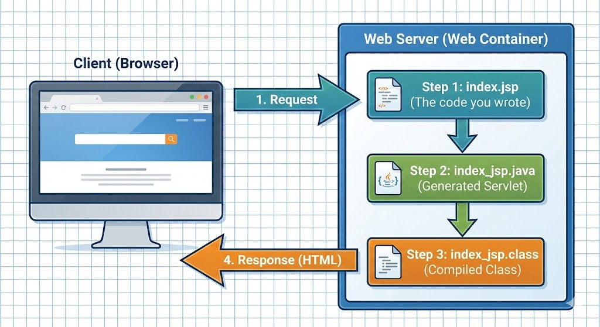
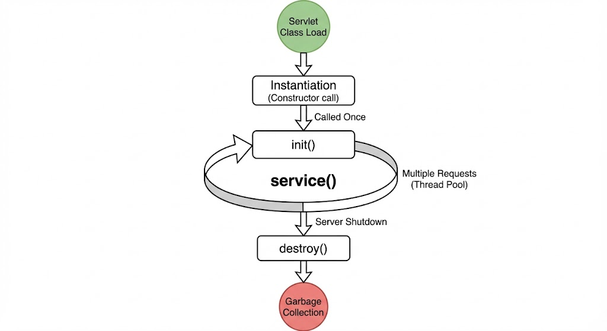
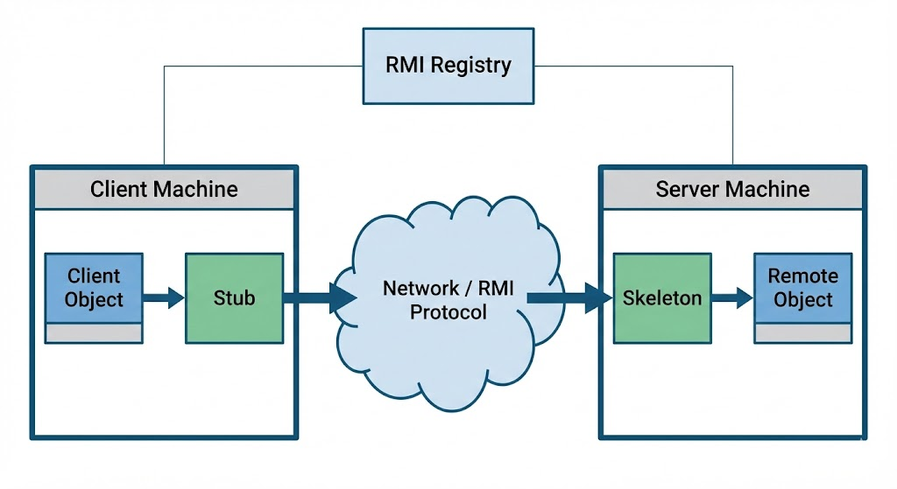
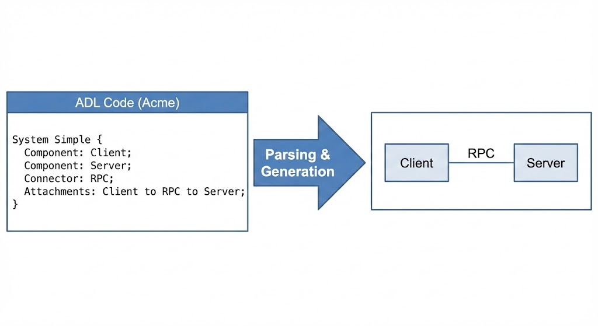
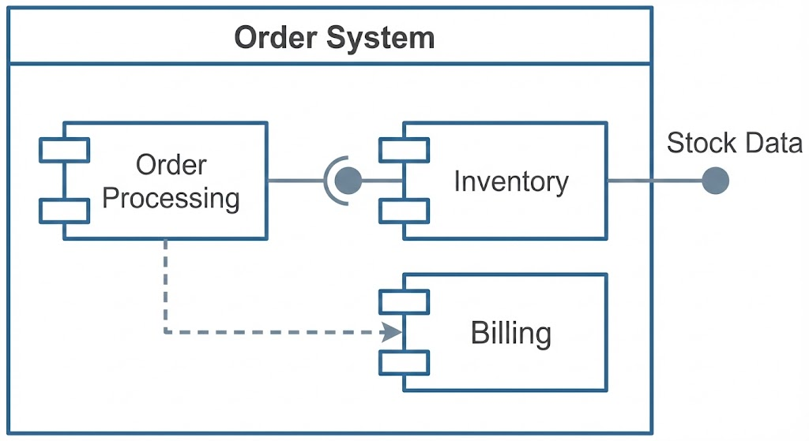
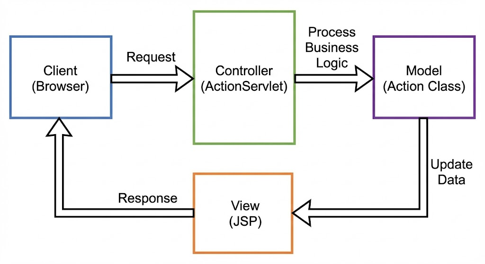
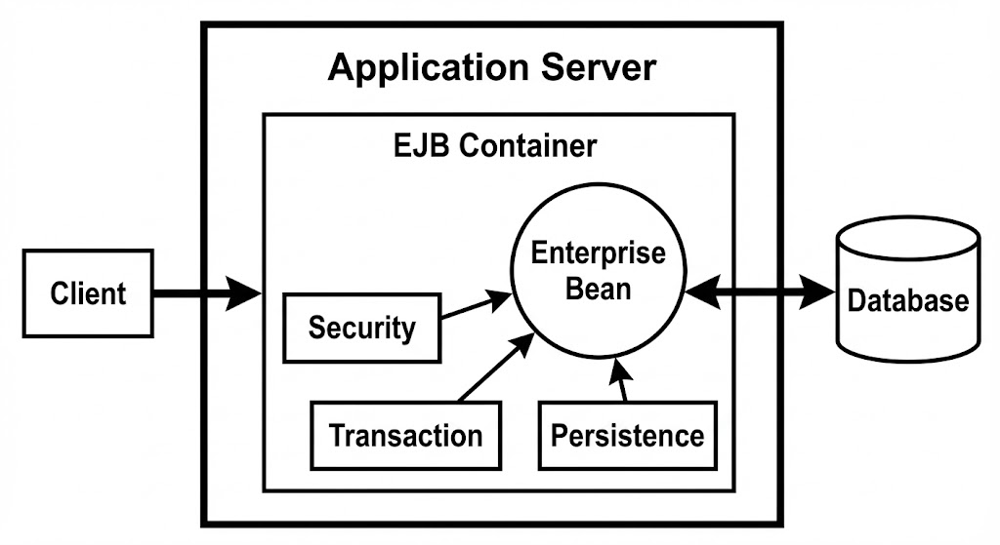

# Ans 1. Node.js aur Angular.js ke beech ka Difference

### 1. Conceptual Definition

**Node.js (The Server-Side Powerhouse):**
Node.js koi framework nahi hai aur ye koi programming language bhi nahi hai. Ye ek open-source, cross-platform **Runtime Environment** hai jo JavaScript code ko web browser ke bahar execute karta hai.

* **Core Mechanism:** Ye Google Chrome ke **V8 JavaScript Engine** par built hai. Ye developers ko allow karta hai JavaScript use karke command-line tools likhne ke liye aur **server-side scripting** ke liye—yani page user ke web browser par bhejne se pehle dynamic web page content produce karne ke liye server-side scripts run karna.
* **Key Philosophy:** Ye ek **Event-Driven, Non-Blocking I/O model** use karta hai jo isse lightweight aur efficient banata hai, jo data-intensive real-time applications ke liye perfect hai jo distributed devices par run hoti hain.

**Angular (The Client-Side Architect):**
Angular (pehle AngularJS) ek complete **Web Application Framework** hai jise Google ki Angular Team lead karti hai. Ye **TypeScript** (JavaScript ka ek superset) par based hai.

* **Core Mechanism:** Ye poori tarah se **Client ke Browser** mein run karta hai. Ye **Single-Page Applications (SPAs)** ki development aur testing ko aasaan banane ke liye design kiya gaya hai, Client-Side Model-View-Controller (MVC) aur Model-View-ViewModel (MVVM) architectures ke liye framework provide karke.
* **Key Philosophy:** Ye HTML ki vocabulary ko extend karta hai. Aap custom HTML tags (**Components**) create kar sakte hain jinka apna logic aur style hota hai.

---

### 2. Architecture Diagram: The Full-Stack Interaction




### 3. Detailed Comparison Table

| Feature | Angular | Node.js |
| :--- | :--- | :--- |
| **Nature & Type** | Ye ek **Client-Side Framework** hai. Ye aapke code ke liye ek structure (scaffolding) provide karta hai. | Ye ek **Server-Side Runtime Environment** hai. Ye code execute karne ke liye engine provide karta hai. |
| **Primary Language** | **TypeScript** (Microsoft) mein likha gaya hai. Browser ke run karne se pehle isse JS mein compilation (transpilation) ki zarurat hoti hai. | **C, C++, aur JavaScript** mein likha gaya hai. Ye standard JavaScript ko server par natively run karta hai. |
| **Architecture Pattern** | Strictly **MVC (Model-View-Controller)** ya Component-Based architecture follow karta hai. Ye aapko code ko modules mein organize karne ke liye force karta hai. | **Event-Driven Architecture** follow karta hai. Ye un-opinionated hai; aap apne folders ko jaise chahein waise structure kar sakte hain. |
| **Core Functionality** | DOM Manipulation, Two-Way Data Binding, Routing, aur View (User Interface) render karne ke liye use hota hai. | File System Access, Database Connections, Network requests, aur Heavy computation ke liye use hota hai. |
| **Installation** | npm ke through as a CLI tool install hota hai: `npm install -g @angular/cli`. | Core Operating System application ki tarah install hota hai (jaise Python ya Java install karna). |
| **Blocking Mechanism** | Ye browser thread mein run karta hai. Agar heavy logic ko sahi se handle na kiya jaye to ye UI ko freeze kar sakta hai. | Ye **Non-Blocking (Asynchronous)** hai. Ye ek khatam hone ka wait kiye bina hazaron concurrent connections handle kar sakta hai. |
| **Use Cases** | Single Page Apps (Gmail, Netflix UI), Progressive Web Apps, Enterprise Dashboards. | Real-time Chat Apps (WhatsApp Web), Streaming Services, REST APIs, Microservices. |

---

### 4. Technical Deep Dive (For Extra Marks)

**A. How Node.js Works (The Event Loop):**
Node.js **"Single-Threaded"** hone ke liye famous hai. Iska matlab hai code execute karne ke liye iske paas sirf ek main thread hai.
* **Scenario:** Agar 100 users data mangte hain, to ek traditional server (jaise Java/PHP) 100 threads create karta hai (jo memory par heavy hota hai).
* **Node Approach:** Node ek single thread aur **Libuv** library use karta hai. Jab koi request aati hai, Node usse background worker ko bhej deta hai aur turant agli request le leta hai. Jab background worker finish karta hai, wo data return karne ke liye ek "callback" trigger karta hai. Ye Node ko highly scalable banata hai.

**B. How Angular Works (Two-Way Data Binding):**
Angular ka sabse powerful feature **Model (Logic)** aur **View (HTML)** ke beech synchronization hai.
* **Scenario:** Agar aap TypeScript code mein variable `userName = "John"` change karte hain, to HTML input box automatically update hokar "John" show karega.
* **Reverse:** Agar user HTML input box mein "Doe" type karta hai, to code mein `userName` variable automatically update hokar "Doe" ho jayega.
Ye manual DOM manipulation (jaise vanilla JS mein `document.getElementById`) ki zarurat ko khatam kar deta hai.

---

### 5. Conclusion

Node.js aur Angular competitors nahi hain; ye **complementary technologies** hain. Ye aksar **MEAN Stack** (MongoDB, Express, Angular, Node) ya MERN Stack (React ke saath) mein saath use hote hain. Angular **"Frontend"** handle karta hai (jo user dekhta hai), jabki Node.js **"Backend"** handle karta hai (jo system karta hai).


# Ans 2. Define JSP. Describe the Life Cycle of Servlets.
### Part A: Java Server Pages (JSP)

**1. Comprehensive Definition**
**Java Server Pages (JSP)** ek server-side technology hai jo dynamic, platform-independent web applications create karne ke liye use hoti hai. Ye Servlet technology ka ek extension hai.

  * **Concept:** JSP developers ko allow karta hai ki wo **HTML code** ko base banakar likhein aur uske andar special tags (jaise `<% ... %>`) use karke **Java code embed** karein. Ye Servlets ka opposite hai, jahan aap Java code likhte hain aur uske andar HTML embed karte hain (jo ki kaafi messy hota hai).
  * **The "Secret" Mechanism (Translation Phase):** Ek JSP page HTML file jaisa dikhta hai, lekin ye directly execute nahi hota. Jab koi user pehli baar JSP request karta hai, to **Web Container** (e.g., Apache Tomcat) `.jsp` file ko **Java Servlet Source file** (`.java`) mein translate karta hai, use **Bytecode Class file** (`.class`) mein compile karta hai, aur fir execute karta hai.
  * **Formula:** `JSP = HTML + Java Code + JSP Tags`

**2. Architecture Diagram: The JSP Execution Flow**
(Isse draw karein internal translation process explain karne ke liye)




**3. Key Features of JSP**

  * **Implicit Objects:** JSP **9 pre-created objects** provide karta hai jinhe aap bina create kiye use kar sakte hain (e.g., `request`, `response`, `session`, `out`, `application`).
  * **JSTL (JSP Standard Tag Library):** Ye raw Java code ke bajaye XML-like tags (`<c:forEach>`) use karke logic (loops, if-else) likhne ki suvidha deta hai.
  * **Performance:** Pehle **"Translation Phase"** ke baad, JSP ek compiled Servlet ban jata hai. Baad wali requests extremely fast hoti hain kyunki server already compiled class ka use karta hai.

**4. Code Comparison (Kyun JSP UI ke liye Servlet se behtar hai)**

**Servlet Style (Hard to maintain):**

```java
PrintWriter out = response.getWriter();
out.println("<html><body>");
out.println("<h1>Hello " + username + "</h1>");
out.println("</body></html>");
```

**JSP Style (Clean & Easy):**

```java
<html>
<body>
   <h1>Hello <%= username %> </h1>
</body>
</html>
```

-----

### Part B: The Life Cycle of a Servlet

**1. Definition** : 
Ek **Servlet** ek Java class hai jo web server par run hoti hai client requests handle karne aur dynamic responses generate karne ke liye. **Servlet Life Cycle** ka matlab events ke us sequence se hai jo Servlet ke creation (birth) se lekar destruction (death) tak hota hai. Ye cycle poori tarah se **Web Container** (e.g., Tomcat) dwara manage ki jati hai, programmer dwara nahi.

**2. The Three Critical Phases (The "Init-Service-Destroy" Model)**
Life cycle `javax.servlet.Servlet` interface dwara define ki gayi hai. Isme teen main methods hain:

  * **Phase 1: Initialization (`init()` method)**

      * **When:** Sirf **ek baar** call hota hai jab Servlet pehli baar request kiya jata hai (ya jab server start hota hai).
      * **Purpose:** One-time setup tasks ke liye use hota hai jaise database connection open karna ya configuration files read karna.
      * **Syntax:** `public void init(ServletConfig config)`

  * **Phase 2: Service (`service()` method)**

      * **When:** **Har baar** call hota hai jab koi nayi request aati hai. Agar 100 users page visit karte hain, to ye method 100 baar run hota hai.
      * **Purpose:** Isme main business logic hota hai. Ye request type (GET, POST) check karta hai aur appropriate method (`doGet`, `doPost`) ko call karta hai.
      * **Syntax:** `public void service(ServletRequest req, ServletResponse res)`

  * **Phase 3: Destruction (`destroy()` method)**

      * **When:** Sirf **ek baar** call hota hai jab server shut down ho raha ho ya Servlet memory se remove kiya ja raha ho.
      * **Purpose:** Cleanup tasks ke liye use hota hai jaise database connections close karna ya state save karna.
      * **Syntax:** `public void destroy()`

**3. Architecture Diagram: Servlet Life Cycle**
(Is state-transition diagram ko draw karein)



**4. Technical Deep Dive: Threading Model**

  * **Single Instance, Multiple Threads:** Web container Servlet class ka sirf **ek instance** create karta hai.
  * **Concurrency:** Har user request ke liye, container ek naya **Thread** create karta hai. Ye thread `service()` method execute karta hai.
  * **Exam Tip:** Isliye Servlets **memory efficient** hote hain CGI (Common Gateway Interface) ke mukable, jo har user ke liye ek naya process create karta tha.

**5. Skeleton Code Example**

```java
public class MyLifeCycleServlet extends HttpServlet {

    // 1. Born
    public void init() {
        System.out.println("Servlet Initialized... DB Connection Opened.");
    }

    // 2. Live (Work)
    public void service(HttpServletRequest req, HttpServletResponse res) {
        System.out.println("Serving a Request... Logic Executed.");
    }

    // 3. Die
    public void destroy() {
        System.out.println("Servlet Destroyed... Cleanup Done.");
    }
}
```


-----

# **Ans 3. RMI aur RPC mein Difference**

*(Question Dec 2024 se)*

#### **1. Conceptual Definition**

  * **RPC (Remote Procedure Call):**
    RPC ek protocol hai jo ek computer par ek program ko server computer par ek program execute karne ki permission deta hai bina programmer ko network interaction ke details explicitly code karne ke.

      * *Paradigm:* Ye **Procedural** programming model follow karta hai (jaise C). Ye function-centric hai. Aap ek function `add(5, 10)` call karte ho aur ye doosri machine par run hota hai.
      * *Limitation:* Ye standard function call mimic karta hai, lekin ye poore "Objects" easily pass nahi kar sakta, sirf data values.

  * **RMI (Remote Method Invocation):**
    RMI, RPC ka **Object-Oriented** equivalent hai, jo specifically **Java** ecosystem ke liye design kiya gaya hai. Ye ek object ko jo ek Java Virtual Machine (JVM) mein run ho raha hai, doosre JVM mein run ho rahe object par methods invoke karne deta hai.

      * *Paradigm:* Ye **Object-Oriented** programming model follow karta hai.
      * *Power:* Ye poore Objects (Serialization ke through) arguments ya return values ke roop mein pass kar sakta hai, unki state aur behavior preserve karte hue.

#### **2. Architecture Diagram: The Stub & Skeleton Model**


#### **3. The Internal Mechanism: Marshalling & Unmarshalling**

*(Isko explain karo extra marks ke liye)*

  * **Marshalling (Packing):** Jab client ek remote method call karta hai, **Stub** parameters (e.g., String, int, Object) leta hai aur unhe network par transmission ke liye suitable format mein "pack" karta hai (Serialization).
  * **Unmarshalling (Unpacking):** Server side par **Skeleton** packet receive karta hai, isko wapas Java objects mein "unpack" karta hai, aur unhe actual method ko pass karta hai.

#### **4. Detailed Comparison Table**

| Feature | RPC (Remote Procedure Call) | RMI (Remote Method Invocation) |
| :--- | :--- | :--- |
| **Paradigm** | **Procedural** (C-style). Functions/procedures par focus karta hai. | **Object-Oriented** (Java-style). Objects aur Methods par focus karta hai. |
| **Language Support** | **Language Neutral**. C ko Python se connect kar sakta hai, etc. (IDL use karke). | **Java Only**. Strictly Java-to-Java communication ke liye design kiya gaya hai. |
| **Parameters** | Ordinary data structures pass karta hai (int, char, struct). Complex objects pass karna hard hai. | **Objects** pass karta hai. Poora Java Object by value (Serialization) ya by reference pass kar sakta hai. |
| **Architecture** | Simpler, older architecture. XDR (External Data Representation) use karta hai. | Complex, modern architecture. JRMP (Java Remote Method Protocol) use karta hai. |
| **Efficiency** | Generally faster (less overhead) lekin program karna harder hai. | Slower (Serialization overhead ke kaaran) lekin program karna bahut easier hai. |
| **Registry** | Typically functions lookup ke liye central registry use nahi karta. | **RMI Registry** (rmiregistry) use karta hai remote objects ko name se bind aur lookup karne ke liye. |

-----

# **Ans 4. CORBA aur RMI par Short Notes**

*(Question Dec 2024 & Nov 2022 se)*

#### **Part A: CORBA (Common Object Request Broker Architecture)**

**1. Definition**
CORBA ek standard hai jo **OMG (Object Management Group)** dwara define kiya gaya hai jo software components ko jo different languages mein likhe gaye hain aur different computers par run ho rahe hain, ek saath kaam karne enable karta hai.

  * *The "Universal Translator":* RMI ke unlike (jo Java-only hai), CORBA ek C++ object ko Linux par ek Java object se Windows par seamlessly baat karne deta hai.

**2. Key Components**

  * **ORB (Object Request Broker):** Ye "Middleware" ya backbone hai. Ye ek switchboard ki tarah kaam karta hai jo clients aur servers ke beech requests ko transparently route karta hai.
  * **IDL (Interface Definition Language):** Ye contract hai. Aap apna interface IDL mein define karte ho, aur phir isko compile karke C++, Java, Python, etc. ke liye code generate karte ho.
  * **IIOP (Internet Inter-ORB Protocol):** Standard protocol jo CORBA internet par communicate karne ke liye use karta hai.

**3. Architecture Diagram: The ORB Structure**
*(Isko draw karo cross-language capability dikhane ke liye)*


**4. Advantages & Disadvantages**

  * **Pros:** Language independent, Platform independent, enterprise systems ke liye highly scalable.
  * **Cons:** Implement karna extremely complex, heavy weight (slow), aur largely Web Services (REST/SOAP) ne modern tech mein replace kar diya hai.

-----

#### **Part B: Java RMI (Remote Method Invocation)**

**1. Definition**
RMI ek Java API hai jo RPC ka object-oriented equivalent perform karti hai. Ye ek Java program ko ek alag JVM par run ho rahe object par methods invoke karne deti hai.

**2. The RMI Development Steps (The Process)**

1.  **Define the Interface:** Ek Java interface create karo jo `java.rmi.Remote` extend kare.
2.  **Implement the Interface:** Ek class create karo jo interface implement kare aur `UnicastRemoteObject` extend kare.
3.  **Create Stub/Skeleton:** `rmic` compiler use karo (purane Java versions mein) network helpers generate karne ke liye.
4.  **Start Registry:** `rmiregistry` run karo taaki clients object ko find kar sakein.
5.  **Bind & Lookup:** Server object name ko "Bind" karta hai; client name ko "Lookup" karta hai.

**3. Code Snippet (Interface Definition)**

```java
import java.rmi.*;

// Step 1: Define the Remote Interface
public interface MyRemoteInterface extends Remote {
    // Methods must throw RemoteException
    public String sayHello() throws RemoteException;
}
```

-----


# **Ans 5. Architecture Description Languages (ADL)**

*(Question Nov 2023 & Nov 2022 se)*

#### **1. Comprehensive Definition**

Ek **Architecture Description Language (ADL)** ek formal language hai jo ek system ki software architecture ko represent aur define karne ke liye use hoti hai.

  * **Programming Language Nahi:** Java ya C++ ke unlike (jo *algorithms* aur *data structures* describe karte hain), ek ADL **Components**, **Connectors**, aur **Configurations** describe karti hai.
  * **Purpose:** Isko stakeholders ko architectural design clearly aur unambiguously communicate karne ke liye use kiya jaata hai. Ye code ki single line likhne se pehle system structure ki **mathematical verification** allow karta hai.
  * **Analogy:** Agar Java "Brick" hai, to ADL "Blueprint" hai. Aap sirf bricks stack karke ek stable skyscraper nahi bana sakte; aapko pehle load aur stress calculate karne ke liye blueprint chahiye.

#### **2. ADL ke Three Core Elements**

Har ADL (jaise Acme, Wright, ya Darwin) teen main building blocks par focus karta hai:

1.  **Components:** Computational units (e.g., Database, Server, Filter).
2.  **Connectors:** Interaction mechanisms (e.g., Pipes, RPC, SQL Queries).
3.  **Configurations:** Components aur connectors ka arrangement ek system mein (The Topology).

#### **3. ADLs ki Key Features (Memorize "C-A-R-A")**

  * **Composition:** ADLs aapko chhote, independent subsystems se complex systems banana allow karte hain.
  * **Abstraction:** Ye implementation details (jaise code logic) hide karte hain aur sirf structural interfaces par focus karte hain.
  * **Reusability:** Defined components aur connectors different system descriptions mein reuse kiye ja sakte hain.
  * **Analysis:** Ye sabse important feature hai. Kyunki ADL formal hai, tools automatically errors check kar sakte hain (e.g., "Kya deadlock hai?", "Kya data types compatible hain?").

#### **4. Architecture Diagram: The ADL Structure**


#### **5. ADLs ke Examples**

  * **Acme:** Ek generic ADL jo tools ke beech interchange ke liye use hota hai.
  * **Wright:** Connectors ke *behavior* ko analyze karne par focus karta hai (deadlock detection).
  * **Darwin:** Distributed systems aur dynamic structures par focus karta hai.

-----

# **Ans 6. Software Architecture mein UML ka Role**

*(Question Nov 2023 & Nov 2022 se)*

#### **1. Comprehensive Definition**

**Unified Modeling Language (UML)** ek standardized, general-purpose modeling language hai jo software system ke artifacts ko visualize, specify, construct, aur document karne ke liye use hoti hai.

  * **Role:** Jabki ADLs *analysis* ke liye hain, UML *communication* ke liye hai. Ye diagrams ka ek standard set provide karta hai jo duniya mein har developer samajhta hai.

#### **2. UML ke 4 Roles (The "V-S-C-D" Model)**

1.  **Visualizing:** Ye architects ko coding se pehle system logic "dekhne" allow karta hai. "Ek picture 1000 lines of code ke barabar hai."
2.  **Specifying:** Ye sabhi design decisions ke liye precise definitions provide karta hai (e.g., "Is class ko us class se inherit *karna chahiye*").
3.  **Constructing:** Modern tools UML diagrams se directly Java/C++ code generate kar sakte hain (Forward Engineering).
4.  **Documenting:** Ye future maintenance ke liye system architecture ka permanent record serve karta hai.

#### **3. Architecture ke liye Key UML Diagrams**

Architecture ko effectively document karne ke liye, hum specific "Views" use karte hain:

  * **Use Case Diagram:** User requirements dikhata hai (Functional View).
  * **Class Diagram:** Static structure aur relationships dikhata hai (Logical View).
  * **Component Diagram:** Dikhata hai ki code modules mein kaise organize hai (Implementation View).
  * **Deployment Diagram:** Dikhata hai ki software hardware par kaise run hota hai (Physical View).
  * **Sequence Diagram:** Dikhata hai ki objects time ke saath kaise interact karte hain (Behavioral View).

#### **4. Architecture Diagram: UML Component Diagram**


#### **5. Comparison: UML vs ADL**

| Feature | UML (Unified Modeling Language) | ADL (Architecture Description Language) |
| :--- | :--- | :--- |
| **Primary Goal** | **Visual Communication** & Documentation. | **Formal Analysis** & Verification. |
| **Precision** | Semi-formal. Ambiguous ho sakta hai (ek box sirf ek box hai). | Formal. Mathematical precision required hai. |
| **Focus** | Class/Object design par focus karta hai (OOP). | Component/Connector design par focus karta hai (Structure). |
| **Usage** | Developers & Designers daily use karte hain. | Specialized Architects critical systems ke liye use karte hain. |

-----

***

# **Ans 7. Struts aur Hibernate Frameworks**
*(Syllabus Topic: Implementation Technologies)*

#### **Part A: Struts Framework**

**1. Definition**
Apache Struts ek open-source framework hai jo Java EE web applications develop karne ke liye use hota hai. Ye strictly **Model-View-Controller (MVC)** architectural pattern par based hai. Ye database code ko HTML code ke saath mix karne ki problem solve karta hai (jo basic JSP/Servlet development mein hota hai) strict separation force karke.

**2. Key Components (The MVC Mapping)**
* **Model (Business Logic):** Data aur business rules represent karta hai. Struts mein, isko **ActionForm Beans** handle karte hain.
* **View (Presentation):** User interface. Struts mein, ye standard **JSP** (JavaServer Pages) hai.
* **Controller (The Boss):** Central component jo traffic direct karta hai. Struts mein, ye **ActionServlet** hai. Ye saari requests receive karta hai aur decide karta hai konsa logic run karna hai.

**3. Architecture Diagram: Struts MVC Flow**
*(Isko draw karo request lifecycle dikhane ke liye)*





#### **Part B: Hibernate Framework**

**1. Definition**
Hibernate ek high-performance **Object-Relational Mapping (ORM)** framework hai Java ke liye.
* **The Problem:** Java **Object-Oriented** hai (Classes, Inheritance), lekin Databases **Relational** hain (Tables, Rows). Wo same language nahi bolte. Isko "Impedance Mismatch" kehte hain.

* **The Solution:** Hibernate beech mein baithta hai. Ye automatically ek Java Class (e.g., `Student`) ko Database Table (e.g., `STUDENT_TBL`) se map karta hai. Developer sirf Objects ke saath kaam karta hai, aur Hibernate SQL handle karta hai.

**2. Key Characteristics**
* **Transparent Persistence:** Aap ek Java object save karte ho (`session.save(student)`), aur Hibernate aapke liye `INSERT INTO...` SQL generate karta hai.
* **Database Independence:** Aap MySQL se Oracle tak switch kar sakte ho sirf XML config file mein ek line change karke, code rewrite kiye bina.
* **Caching:** Isme built-in caching mechanism hai database hits reduce karne aur speed improve karne ke liye.

**3. Architecture Diagram: Hibernate ORM**
*(Isko draw karo mapping dikhane ke liye)*


# **Ans 8. Enterprise Java Beans (EJB)**
*(Syllabus Topic: J2EE Technologies)*

**1. Definition**
**Enterprise Java Beans (EJB)** ek server-side software component architecture hai jo enterprise applications ki modular construction ke liye use hota hai.
Jabki Servlets "Web" part handle karte hain (HTTP requests), EJBs "Heavy Lifting" ya **Business Logic** handle karte hain. Ye complex enterprise problems jaise **Transaction Management**, **Security**, aur **Concurrency** automatically solve karne ke liye design kiye gaye hain.

**2. EJB ke Three Types**
* **1. Session Beans (The "Verbs"):**
    * Ye client ke liye ek task perform karte hain.
    * *Stateless:* Ek task karta hai aur client ko bhool jaata hai (e.g., Calculate Tax).
    * *Stateful:* Multiple calls mein client ko yaad rakhta hai (e.g., Shopping Cart).
* **2. Entity Beans (The "Nouns"):**
    * Ye persistent data represent karte hain jo database mein stored hai.
    * *Example:* Ek "Bank Account" bean directly Accounts table mein ek row se map hota hai. (Note: Ab largely JPA/Hibernate ne replace kar diya hai).
* **3. Message-Driven Beans (The "Listeners"):**
    * Ye asynchronous messages handle karte hain. Ye baith ke Queue (JMS) se message ka wait karte hain aur jab aata hai tab process karte hain.

**3. Architecture Diagram: EJB Container**
*(Isko draw karo dikhane ke liye ki EJB kahan rehta hai)*



***

# **Ans 9. J2EE Middleware: JDBC, JNDI, aur JMS**
*(Syllabus Topic: Middleware)*

#### **Part A: JDBC (Java Database Connectivity)**

**1. Definition**
JDBC ek standard Java API hai jo independent Java applications ko wide variety ke relational databases se connect karne ke liye hai. Ye ek Java program ko SQL statements execute karne deta hai.

**2. Architecture Diagram: JDBC Bridge**
* **Java App** $\rightarrow$ **JDBC Manager** $\rightarrow$ **Driver (Oracle/MySQL)** $\rightarrow$ **Database**.
* *Key Concept:* Java app ko nahi pata ki wo kaunse DB se baat kar raha hai; **Driver** translation handle karta hai.


[Image of JDBC Architecture Diagram]


#### **Part B: JNDI (Java Naming and Directory Interface)**

**1. Definition**
JNDI ek API hai jo Java applications ko data aur resources lookup karne deta hai ek **name** ke through. Ye server ke liye ek "Phonebook" ki tarah kaam karta hai.
* **Scenario:** Database IP address ko apne code mein hardcode karne ki jagah (jo bad hai), aap database ko ek naam dete ho jaise `"jdbc/MyDB"`. Java app JNDI se puchta hai: *"jdbc/MyDB kahan hai?"* aur JNDI connection return karta hai.

**2. Use Case**
* EJB aur JDBC mein heavily use hota hai network par resources find karne ke liye unki physical location jaane bina.

#### **Part C: JMS (Java Message Service)**

**1. Definition**
JMS ek API hai jo separate software components ko ek doosre ko **messages** bhejke asynchronously (wait kiye bina) communicate karne deta hai. Ye "Sender" ko "Receiver" se decouple karta hai.

**2. The Two Models**
* **Point-to-Point (Queue):** Ek message Queue ko bheja jaata hai. Sirf **ek** receiver ise paata hai. (e.g., Shipping Dept ko Order bhejna).
* **Publish-Subscribe (Topic):** Ek message Topic par publish hota hai. **Multiple** subscribers ko copy milti hai. (e.g., Saare traders ko Stock Price update broadcast karna).

**3. Architecture Diagram: JMS Queue**
* **Sender** $\rightarrow$ **[ Message Queue ]** $\rightarrow$ **Receiver**.
* *Caption:* "JMS ke through Asynchronous Messaging."


***

