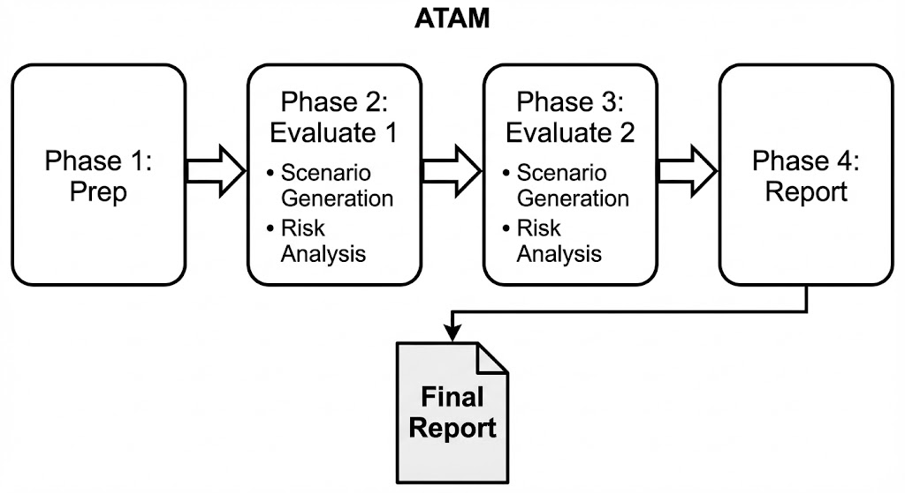
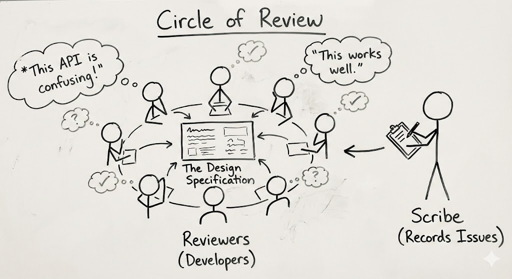
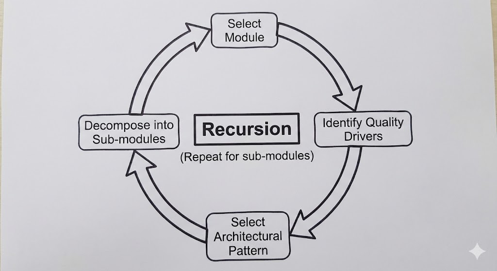
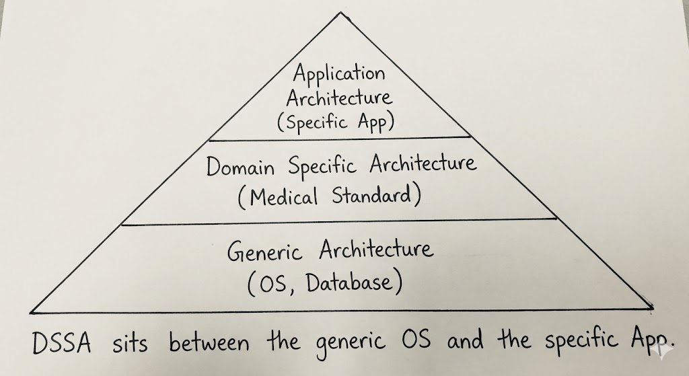

---

# **Ans 1. Architecture Tradeoff Analysis Method (ATAM)**

*(Repeated: Nov 2023, Nov 2022)*

#### **1. Conceptual Definition**

**ATAM** ek structured method hai jo software architecture ko **system build hone se pehle** evaluate karne ke liye use hota hai.

* **The Goal:** Ye dekhna ki architecture particular **Quality Attributes** (jaise Performance, Security, Modifiability) ko satisfy karta hai ya nahi, aur kaunse **Trade-offs** present hain.
* **The "Trade-off" Concept:** Aap sab kuch ek saath nahi paa sakte.

  * *Example:* Agar aapko high **Security** (Encryption) chahiye, toh aap **Performance** (Speed) lose kar sakte ho. ATAM stakeholders ko decide karne me help karta hai ki ye trade-off acceptable hai ya nahi.

#### **2. The 4 Phases of ATAM (Memorize: "P-E-E-F")**

ATAM char distinct phases me perform hota hai:

* **Phase 1: Partnership & Preparation:**

  * Evaluation Team Project Leaders se milti hai.
  * Wo decide karte hain: "Kaun attend karega?" (Stakeholders) aur "Hum kya evaluate kar rahe hain?" (Scope).

* **Phase 2: Evaluation (Round 1):**

  * Architect design present karta hai.
  * Team **Business Goals** identify karti hai (e.g., "Must launch in 3 months").
  * Team **Quality Attribute Scenarios** generate karti hai (e.g., "Agar server fail ho jaye, toh 1 second me restart hona chahiye").

* **Phase 3: Evaluation (Round 2):**

  * Zyada stakeholders join hote hain.
  * Wo scenarios ko **Prioritize** karte hain (Vote karte hain kaun important hai).
  * Wo architecture ko top priorities ke against analyze karte hain, **Risks** aur **Trade-offs** dhundte hain.

* **Phase 4: Follow-Up:**

  * Team final report likhti hai.
  * Report me hota hai: Risks, Non-Risks, Sensitivity Points, Trade-offs.

#### **3. Architecture Diagram: The ATAM Workflow**

#### **4. Real-World Example: Banking App**

* **Goal:** High Security (har transaction encrypt hona chahiye).
* **ATAM Analysis:**

  * *Scenario:* User money transfer karta hai.
  * *Conflict:* Encryption 2 seconds leti hai. Requirement kehti hai "Transfer in 1 second."
  * *Trade-off:* Hum slow transfer accept karte hain taaki paise safe rahein.

---

# **Ans 2. Active Reviews for Intermediate Design (ARID)**

*(Repeated: Dec 2024, Nov 2023)*

#### **1. Conceptual Definition**

**ARID** ek evaluation method hai jo **partial** ya **incomplete** designs ke liye use hota hai.

* **The Problem:** ATAM ko ek *complete* architecture chahiye hota hai. Par agar aap halfway ho? Ya sirf "Service Layer" test karna chahte ho?
* **The Solution:** ARID allow karta hai ki aap design ke specific part ko "Active-ly" test karo by simulating how a developer would use it. Ye ek **Review** aur **Test** ka mix hai.

#### **2. Key Characteristics**

1. **Target Audience:** Ye un **Developers** ke liye hota hai jo architecture use karenge (managers nahi).
2. **Focus:** Ye **Suitability** test karta hai. "Kya ye design actually usable hai?"
3. **Active Participation:** Reviewers sirf padhte nahi, balki pseudo-code likhte hain design ko "test drive" karne ke liye.

#### **3. ATAM vs. ARID (Comparison Table)**

| Feature    | ATAM (Trade-off Analysis)                             | ARID (Active Review)                          |
| :--------- | :---------------------------------------------------- | :-------------------------------------------- |
| **Scope**  | Complete Architecture.                                | Partial / Incomplete Design.                  |
| **Goal**   | Risks & Trade-offs dhundna (Performance vs Security). | Usability Issues dhundna (Kya API easy hai?). |
| **Method** | Scenario-based analysis.                              | "Test-drive" simulation (Pseudo-code likhna). |
| **Who?**   | All Stakeholders (Managers, Users).                   | Mostly Designers & Developers.                |

#### **4. Architecture Diagram: The ARID Process**

---

# **Ans 3. Cost Benefit Analysis Method (CBAM)**

*(Repeated: Nov 2022)*

#### **1. Conceptual Definition**

**CBAM** ek economic modeling method hai. Ye usually **ATAM ke baad** perform hota hai.

* **The Logic:** ATAM batata hai *kya* decisions possible hain (e.g., "Add a Firewall"). CBAM batata hai ki aapko ye decisions **leni chahiye ya nahi**, based on **Money (ROI)**.
* **The Question:** "Kya is architectural change ka cost us benefit ke worth hai jo wo deta hai?"

#### **2. The Process Steps**

1. **Collate Scenarios:** ATAM ke scenarios lo.
2. **Refine Scenarios:** Best/worst case responses determine karo.
3. **Prioritize:** Stakeholders vote karte hain kaunse scenarios sabse zyada **Utility** (Value) dete hain.
4. **Assign Cost:** Architect estimate karta hai: "Isko build karne me $10,000 lagenge."
5. **Calculate ROI:** `(Benefit / Cost)`.
6. **Decide:** Highest ROI wale features pehle implement karo.

#### **3. Architecture Diagram: The ROI Graph**

---

# **Ans 4. Attribute Driven Design (ADD) Method**

*(Repeated: Dec 2024, Nov 2022)*

#### **1. Conceptual Definition**

**Attribute Driven Design (ADD)** ek systematic method hai software architecture ko **design karne** ke liye.

* **The Core Philosophy:** System ki architecture primarily uske **Quality Attributes** (Performance, Security, Modifiability) se shape hoti hai, sirf functionality se nahi.
* **How it works:** Yeh ek **Recursive Decomposition** process hai. Aap system lete ho, sabse tough requirements (Drivers) choose karte ho, unke liye solution design karte ho, fir bache hue parts ko chhote modules me tod dete ho. Yeh process tab tak repeat hota hai jab tak har module design na ho jaye.

#### **2. The 5 Steps of ADD**

1. **Choose the Module:** Puri system (ya ek large subsystem) se start karo.
2. **Identify Drivers:** "Architectural Drivers" dhoondo — woh requirements jo satisfy karna sabse mushkil hota hai (e.g., "1 million transactions/sec process karna hoga").
3. **Choose a Pattern:** Koi Architectural Tactic ya Pattern choose karo jo in drivers ko solve kare (e.g., performance ke liye "Load Balancer pattern").
4. **Instantiate Modules:** System ko chosen pattern ke basis par child modules me tod do.
5. **Verify & Repeat:** Check karo ki drivers satisfy hue ya nahi. Agar haan, toh Step 1 par return karo aur child modules ke liye repeat karo.

#### **3. Architecture Diagram: The ADD Cycle**

#### **4. Comparison: ADD vs ATAM**

* **ADD** architecture ko **CREATE** karne ke kaam aata hai (Design Phase).
* **ATAM** architecture ko **CHECK** karne ke kaam aata hai (Evaluation Phase).

---

# **Ans 5. Domain-Specific Software Architecture (DSSA)**

*(Syllabus Topic)*

#### **1. Conceptual Definition**

**DSSA** ek standardized architectural structure hota hai jo kisi **industry ya domain** (jaise Avionics, Medical Records, E-Commerce) ke system family ke liye banaya jata hai.

* **The Goal:** Naye se system mat banao. Agar "Flight Simulator" bana rahe ho, toh wahi standard "Flight Simulator Architecture" use karo jo already exist karti hai.

#### **2. Key Components of DSSA**

1. **Reference Architecture:** Domain ka standard blueprint.
2. **Reference Model:** Standard dictionary of terms (jaise hospital domain me sab agree karte hain ki "Patient" ka matlab kya hota hai).
3. **Reusable Components:** Pre-built code blocks (jaise "Billing Module" jo kisi bhi hospital me kaam kar sakta hai).

#### **3. Architecture Diagram: DSSA Pyramid**

#### **4. Real-World Example**

**AUTOSAR (Automotive Open System Architecture):**
Har car manufacturer (BMW, Ford, Toyota) **AUTOSAR** standard use karta hai car software ke liye. Isse "Brake System" jaise component Bosch ka ho, toh woh BMW me bhi chalega aur Ford me bhi.

---

### **Ans 6. Architecture Reuse**

*(Syllabus Topic)*

#### **1. Conceptual Definition**

Architecture Reuse ka matlab hai existing architectural assets (patterns, frameworks, code, designs) ko new system me use karna taaki cost aur risk kam ho.

* **Why Reuse?** "Sabse best code woh hota hai jo likhna hi na pade." Reused architecture already tested aur proven hota hai.

#### **2. Levels of Reuse**

1. **Code Reuse:** Functions copy-paste karna (Low level).
2. **Component Reuse:** Libraries use karna (e.g., `npm` packages, DLLs).
3. **Framework Reuse:** Spring Boot ya Angular use karna (High level).
4. **Pattern Reuse:** "Model-View-Controller" ya "Microservices" use karna.

#### **3. The Barrier to Reuse**

* **"Not Invented Here" Syndrome:** Developers aksar naye se likhna pasand karte hain instead of dusre ka code samajhna.
* **Context Mismatch:** Reused component kabhi kabhi new system ke liye too heavy ya too specific hota hai.

---

### **Ans 7. Requirements for Architecture**

*(Syllabus Topic)*

#### **1. Definition**

Architecture design ke inputs **Requirements** hote hain. Ye do types me divide hote hain:

* **Functional Requirements:** System **kya** karta hai. (e.g., "User button click kare -> Money transfer ho").
* **Non-Functional Requirements (Quality Attributes):** System **kitna achha** karta hai. (e.g., "Money transfer < 1 second me ho").

#### **2. The Life-Cycle View**

Architecture ek one-time step nahi hai. Iska poora life cycle hota hai:

1. **Requirement Analysis:** Quality Attributes identify karna.
2. **Design:** Architecture create karna (ADD).
3. **Documentation:** Sab likhna (Unit 5).
4. **Evaluation:** Check karna (ATAM).
5. **Implementation:** Code banana (Unit 3).
6. **Reconstruction:** Purane code ko reverse-engineer karke architecture banana.

---
