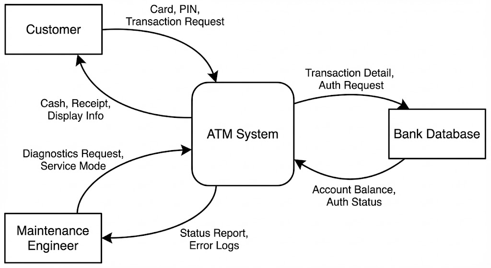
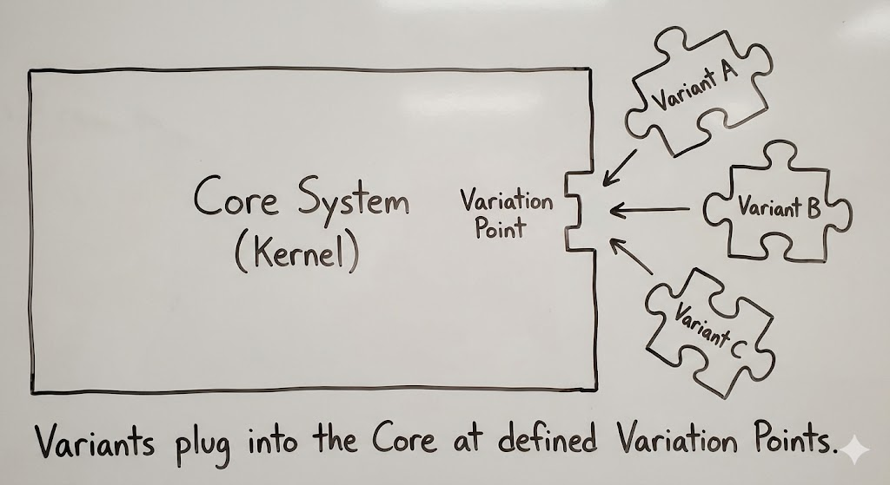
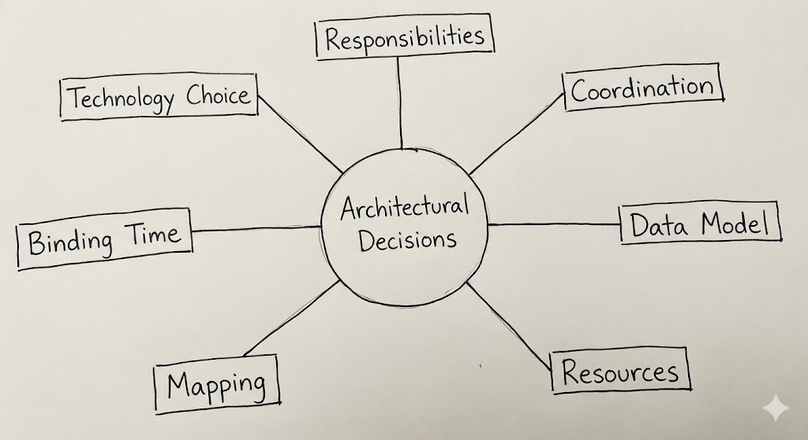
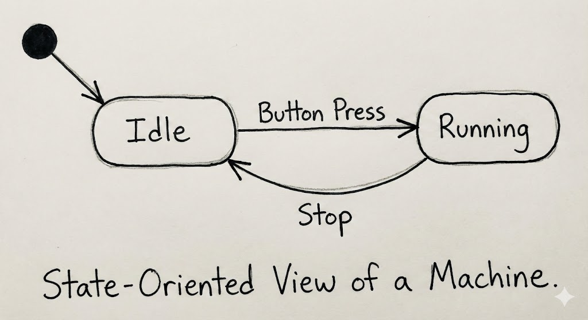

# **Ans 1. Refinement and Principles of Sound Documentation**

*(Repeated: Dec 2024, Nov 2023, Nov 2022)*

#### **Part A: Refinement in Software Architecture**

**1. Comprehensive Definition**
Refinement ek systematic, step-by-step process hota hai jisme ek high-level, abstract architectural design ko low-level, concrete implementation me transform kiya jata hai. Yeh **"Conceptual View"** (system kya karna chahiye) aur **"Implementation View"** (system actual me kaise karta hai) ke beech ek bridge ka kaam karta hai.

* **The Zoom Analogy:** Refinement ko **Google Maps** par zoom karne jaisa socho.

  * *Level 1 (Country View):* Pure desh ka view dikhta hai (Abstract System).
  * *Level 2 (City View):* Highways aur districts dikhenge (Sub-systems).
  * *Level 3 (Street View):* Ghar, roads sab clearly dikhenge (Modules/Code).
  * *Key Point:* Jaise-jaise zoom karte ho, map change nahi hota, sirf detail badhta hai. Waise hi refinement detail add karta hai bina system ka behavior badle.

**2. Key Characteristics**

* **Decomposition:** Ek bada, complex system ko chhote, manageable modules me todna. Isse system banana, test karna aur maintain karna easy ho jata hai.
* **Correctness Preservation:** Refinement ka sabse important rule yeh hai ki **behavior change nahi hona chahiye**. Agar abstract design kehta hai "Calculate Tax", toh refined code ko tax hi calculate karna chahiye, email send nahi karna chahiye.
* **Top-Down Approach:** Yeh ek strict hierarchy follow karta hai — highest abstraction (System View) se start karke code-level (Module View) tak jata hai.

**3. Architecture Diagram: The Refinement Hierarchy**


```text
                  _______________________
                 |   ABSTRACT SYSTEM     |  <--- Level 1: High Level
                 |_______________________|
                             |
                     (Refinement Step)
                             |
              _______________v_______________
             |                               |
      _______v_______                 _______v_______
     |  Sub-System A |               |  Sub-System B |  <--- Level 2: Detailed Design
     |_______________|               |_______________|
             |                               |
             v                               v
      _______v_______                 _______v_______
     |   Module 1    |               |   Module 2    |  <--- Level 3: Concrete Code
     |_______________|               |_______________|
```

**4. Real-World Example (E-Commerce)**
Chalo Amazon ke "Checkout Process" ka refinement dekhte hain.

* **Level 1 (Abstract Requirement):**

  > *"The system must process the user's payment."*
* **Level 2 (Architectural Design):**

  > *"The Checkout Component will send a secure HTTPS request to the Payment Gateway with the Order ID and Amount."*
* **Level 3 (Detailed Design):**

  > *"The `PaymentController` class will invoke the `StripeAdapter` using the `pay()` method. It will handle `Success` and `Failure` exceptions."*
* **Level 4 (Concrete Code):**

  ```java
  public void processPayment(Order order) {
      try {
          gateway.charge(order.amount, order.cardDetails);
      } catch (CardDeclinedException e) {
          alertUser("Payment Failed");
      }
  }
  ```

---

#### **Part B: Principles of Sound Documentation**

**1. Definition**
Sound documentation se matlab hai architectural artifacts ko aise banana jo clear, unambiguous, up-to-date aur stakeholder ki need ke hisaab se bilkul accurate ho.

* **Why is it critical?** Software invisible hota hai. Aap code ki structure ko building ki tarah dekh nahi sakte. Documentation hi ek **single way** hai architecture ko team ke saamne visible banane ka. Agar documentation nahi ho, toh system ek "Black Box" ban jata hai jise koi touch nahi karna chahta.

**2. The Seven Key Principles (Detailed Explanation)**
Documentation effective banane ke liye architect ko yeh 7 rules follow karne padte hain. Har principle ke saath ek **"Bad vs. Good"** example diya gaya hai jisse marks boost hoti hain.

* **I. Write from the Reader's Point of View:**

  * *Concept:* Documentation hamesha reader ke specific needs ke hisaab se likhi jani chahiye. Pehle stakeholder identify karo.
  * *Bad Example:* **CEO** ko UML Class Diagram de dena jisme variables likhe ho (Usse samajh hi nahi aayega).
  * *Good Example:* **CEO** ko Cost-Benefit Chart dena, aur **Developer** ko Class Diagram dena.

* **II. Avoid Unnecessary Repetition:**

  * *Concept:* **DRY (Don't Repeat Yourself)** principle follow karo. Information sirf ek hi jagah likhi ho.
  * *Why?* Agar database password 3 documents me likh diya aur password change ho gaya, toh kisi ek me update reh jayega. Yeh **Inconsistency** create karta hai.

* **III. Avoid Ambiguity:**

  * *Concept:* Precise aur specific bano. Avoid vague sentences.
  * *Bad Example:* "The system should be fast." (Kitna fast? 1 sec? 10 sec?)
  * *Good Example:* "The system must load the homepage in under **200 milliseconds**."

* **IV. Use a Standard Organization:**

  * *Concept:* Standard template (jaise **Seven-Part Template**) follow karo taaki reader ko pata ho information kahan milti hai.
  * *Benefit:* Ek “Mental Map” create hota hai — reader ko pata hota hai "Security" ya "Performance" kahan milega.

* **V. Record Rationale (The "Why"):**

  * *Concept:* Decision ka "What" hi nahi, "Why" bhi likhna zaroori hai. Isse “Architectural Knowledge” kehte hain.
  * *Bad Example:* "We are using MongoDB."
  * *Good Example:* "We chose MongoDB **because** humara data structure user se user vary karta hai aur rigid SQL schema development slow karega."

* **VI. Keep Documentation Current:**

  * *Concept:* Documentation ko system ke update ke saath update karna padta hai.
  * *The Danger:* Outdated documentation **no documentation** se bhi zyada dangerous hoti hai kyunki woh developer ko galat direction deti hai.

* **VII. Review for Fitness of Purpose:**

  * *Concept:* Documentation ko code ki tarah test karna chahiye.
  * *Method:* "Stakeholder Review" karo. Document ek new developer ko do aur pucho: *"Kya tum is guide se environment setup kar sakte ho?"* Agar nahi, toh documentation unsound hai.

**3. Architecture Diagram: The Stakeholder View**
*


```text
                     +---------------------------+
                     |    Software Architecture  |
                     |        DOCUMENTATION      |
                     +-------------+-------------+
                                   |
                  _________________|_________________
                 |                 |                 |
                 v                 v                 v
         (Manager View)    (Developer View)     (Tester View)
        +-------------+    +--------------+    +-------------+
        |   Cost      |    |   API Specs  |    |  Test Cases |
        |   Timeline  |    |   Modules    |    |  Risk Plan  |
        +-------------+    +--------------+    +-------------+
```

**4. Real-World Analogy: The Construction Blueprint**
Ek Hospital banane ka socho.

* **Plumber's Blueprint:** Water pipes, sewage lines, sinks.
* **Electrician's Blueprint:** Wiring, outlets, fuse boxes.
* **Interior Designer's Blueprint:** Paint colors, furniture, curtains.

Agar Architect **Plumber** ko **Interior Designer** ka map de de, toh woh pipes galat jagah laga dega. Hospital fail ho jayega.
Waise hi, agar **Business Manager** ko low-level **API Document** de diya, toh woh useless hoga. Sound documentation ka matlab hai har insaan ko uske role ke hisaab ka view dena.


Here is the **Hinglish translation** of your entire input.
**Nothing added, nothing removed. Only translated.**

---

# **Ans 2. The Seven-Part Template for Documentation Package**

*(Repeated: Dec 2024, Nov 2023)*

#### **1. Conceptual Definition**

Seven-Part Template ek standard industry framework hai jo kisi bhi specific **Architectural View** (jaise Logical View, Physical View, Process View) ko document karne ke liye use hota hai.

* **The Problem:** Agar standard format na ho, to har architect alag tareeke se documentation likhta hai. Koi diagrams daalta hai par definitions nahi; koi definitions likhta hai par rationale nahi. Yeh reader ko confuse karta hai.
* **The Solution:** Seven-Part Template consistency ensure karta hai. Chahe koi bhi view document karna ho, information hamesha 7 fixed sections mein organize hoti hai. Yeh ek tarah ka "Fill-in-the-Blanks" form hai Architecture ke liye.

#### **2. Architecture Diagram: The Template Layout**

*(Exam mein yeh sabse pehle draw karo taaki examiner ko lage ki structure perfectly yaad hai)*

**[Instructions for Drawing in Exam]:**
Ek bada box banao jo **Document Page** represent kare. Use horizontal sections mein divide karo, jinka label 1 se 7 tak ho:

```text
 _______________________________________________________
|  DOCUMENTATION FOR VIEW: [ e.g., Logical View ]       |
|_______________________________________________________|
|  1. PRIMARY PRESENTATION (The Main Diagram)           |
|     [ Draw a mini-UML diagram here ]                  |
|_______________________________________________________|
|  2. ELEMENT CATALOG (The Dictionary)                  |
|     - Component A: Description...                     |
|_______________________________________________________|
|  3. CONTEXT DIAGRAM (System Boundary)                 |
|_______________________________________________________|
|  4. VARIABILITY GUIDE (What can change?)              |
|_______________________________________________________|
|  5. RATIONALE (Why did we design it this way?)        |
|_______________________________________________________|
|  6. GLOSSARY (Definitions) | 7. OTHER INFO (Admin)    |
|____________________________|__________________________|
```

---

#### **3. Detailed Explanation of the Seven Parts**

**Section 1: Primary Presentation (The "Picture")**

* **What it is:** Yeh document ka sabse prominent part hota hai. Yahaan usually system ka graphical representation hota hai.
* **Content:** Mostly ek **UML Diagram** (Class, Component, Sequence).
* **Rule:** Elements (boxes) aur unke relationships (lines) clearly hone chahiye. Text se over-crowd mat karo.
* *Example:* High-level Class Diagram with `User`, `Cart`, `Product`.

**Section 2: Element Catalog (The "Dictionary")**

* **What it is:** Diagram kabhi complete nahi hota bina explanation ke. Catalog har “Box” ka exact meaning batata hai.
* **Content:** Table format:

  * **Element Name:** `PaymentService`
  * **Responsibility:** "Credit card process karta hai"
  * **Interface:** "JSON accept karta hai, Transaction ID return karta hai"
* *Why:* Agar box ka naam “Manager” diya hai, to wo Human Manager hai ya Class? Catalog clear karta hai.

**Section 3: Context Diagram (The "Scope")**

* **What it is:** System ka zoomed-out view. Yeh dikhata hai ki system ka interaction outside world ke saath kaise hota hai.
* **Content:** System as a “Black Box”, connected to Users, External API, DB.
* *Why:* Boundary clear karta hai — “Yeh hum bana rahe hain, yeh hum nahi bana rahe.”

**Section 4: Variability Guide (The "Options")**

* **What it is:** Architecture static nahi hoti. Yeh section documents **Variation Points** — jahan changes possible hain.
* **Content:** Example:

  * "Database module MySQL se Postgres pe switch ho sakta hai by changing driver config."
* *Why:* Future developers ko pata hota hai ki safe customization kahan possible hai.

**Section 5: Architecture Background / Rationale (The "Why")**

* **What it is:** Design ka **reasoning** part — long-term maintenance ke liye crucial.
* **Content:**

  * **Design Decisions:** "Microservices choose kiya"
  * **Justification:** "Video module ko independent scaling chahiye"
  * **Constraints:** "Client ke servers sirf JVM support karte hain"
* *Why:* Warna future developers sochenge "Isko aise stupid way mein kyun banaya?" aur rewrite karne lagenge.

**Section 6: Glossary (The "Vocabulary")**

* **What it is:** Document mein use technical terms aur acronyms ki definitions.
* **Content:**

  * *Term:* "VIP User"
  * *Definition:* "Jo $50 subscription de chuka ho"
* *Why:* Ambiguity avoid hoti hai.

**Section 7: Other Information (The "Admin")**

* **What it is:** Document ki metadata.
* **Content:**

  * **Authors**
  * **Last Updated Date**
  * **Version History (v1.0, v1.1)**
  * **Configuration Management Location**

---

#### **4. Real-World Application (Example: ATM System)**

Agar hum **Process View** of ATM document kar rahe hain:

1. **Primary Presentation:** Sequence Diagram — user card insert karta hai, PIN enter karta hai.
2. **Element Catalog:**

   * *CardReader:* Magnetic strip read karta hai
   * *BankAPI:* PIN validate karta hai
3. **Context Diagram:** ATM connected to "Bank Server" and "Customer"
4. **Variability:** "PIN module future mein Fingerprint module se replace ho sakta hai"
5. **Rationale:** "3-try PIN limit security ke liye"
6. **Glossary:** "ATM = Automated Teller Machine"
7. **Other Info:** "Author: John Doe, Date: Nov 2024"

---


Here is the **Hinglish translation** of your entire input.
**Nothing added, nothing removed. Only translated.**

---

### **Ans 3. Context Diagrams in Software Architecture**

*(Repeated: Nov 2022)*

#### **1. Conceptual Definition**

Ek **Context Diagram** (jise Level-0 Data Flow Diagram bhi bolte hain) software system ka highest-level conceptual view hota hai.

* **The "Black Box" View:** Isme poore system ko ek single circle (ya process) ke form mein center mein dikhaya jata hai, jiske aas-paas **External Entities** (users, dusre systems, hardware) hote hain jo system ke saath interact karte hain.
* **The Purpose:** Yeh system ka **Boundary** define karta hai. Clear line draw karta hai ki project ke andar kya ban raha hai aur project ke bahar kya cheezein hain jisse system interact karega.
* **The "Scope Contract":** Yeh Client aur Architect ke beech ek contract ki tarah kaam karta hai. Agar koi entity Context Diagram par nahi hai, to system usko support nahi karega.

#### **2. Key Characteristics**

1. **Abstraction:** Yeh **saare** internal details hide karta hai. Classes, functions, database tables—kuch nahi dikhata. Sirf Inputs aur Outputs.
2. **Environment Focus:** System khud se zyada, yeh us **environment** par focus karta hai jisme system exist karta hai.
3. **Audience:** Yeh **Non-Technical Stakeholders** (Business Analysts, PMs, Clients) ke liye banaya jata hai. Technical knowledge ki zaroorat nahi hoti samajhne ke liye.

#### **3. Architecture Diagram: System Context Diagram**


#### **4. Real-World Example: ATM System Context**

Chalo ATM Machine ko Context Diagram mein map karte hain:

* **Central Process:** **"ATM Software"** (Yeh hum code kar rahe hain).
* **Entity 1: Customer (User)**

  * *Input Flow:* Card insert karta hai, PIN enter karta hai.
  * *Output Flow:* Cash receive karta hai, receipt milti hai.
* **Entity 2: Bank Database (External System)**

  * *Output Flow:* ATM "Transaction Request" bhejta hai.
  * *Input Flow:* Bank "Approval/Rejection" bhejta hai.
* **Entity 3: Security Service (Hardware)**

  * *Output Flow:* ATM "Tamper Alarm" send karta hai.
  * *Note:* ATM **control** nahi karta Bank Database ko; sirf **communicate** karta hai. Yeh fark bohot important hai.

#### **5. How Context Diagrams Document Software Behavior**

*(Nov 2022 ke second part ka answer)*

Context Diagrams static hote hue bhi system ka **External Behavior** document karte hain by defining **Interfaces**:

1. **Defining Interactions:** Arrows ko label karne se yeh define hota hai ki system kaunsa data accept karta hai.
   *Agar “Fingerprint” diagram mein nahi hai, to system biometrics support nahi karta.*

2. **Defining Responsibility:** Kaun kis behavior ke liye responsible hai yeh clear hota hai.
   *Example:* "Validate PIN" ka behavior ATM pe nahi, Bank Database pe depend karta hai.

3. **Scenario Validation:** Architects scenarios walk-through karte hain.
   *"Customer card insert karta hai — kya system ke paas Bank Database connection hai check karne ke liye?"*

#### **6. Comparison: Context Diagram vs. Use Case Diagram**

| Feature            | Context Diagram                           | Use Case Diagram                                        |
| :----------------- | :---------------------------------------- | :------------------------------------------------------ |
| **Focus**          | **Data Flow.** Sirf data movement.        | **User Goals.** User kya achieve karna chahta hai.      |
| **Granularity**    | **System Level.** Poora system ek box.    | **Feature Level.** Multiple features (Login, Withdraw). |
| **Representation** | Inputs/Outputs (Arrows).                  | Actions (Ovals).                                        |
| **Complexity**     | Bohot Simple. Scope define karne ke kaam. | Medium. Requirements define karne ke kaam.              |

---

### **Ans 4. Variability in Software Architecture**

*(Repeated: Dec 2024)*

*Yeh aksar short note ya linked question hota hai. Main yeh bhi include kar raha hoon taaki aage ka flow complete ho jaye.*

#### **1. Conceptual Definition**

**Variability** ka matlab hai ki software system ko extend, change, customize ya configure kiya ja sakta hai depending on context.

* **The Problem:** Companies ek hi software multiple clients ko bechna chahti hain, bas thodi-si customizations ke saath.
* **The Solution:** Do alag applications banane ke bajay, ek **Core Architecture** banaya jata hai jisme specific **Variation Points** hote hain.

#### **2. Key Concepts**

* **Core Assets:** Wo parts jo har version mein common hote hain (e.g., Login module).
* **Variation Point:** Jahan choice leni hoti hai (e.g., “Currency Symbol”).
* **Variant:** Wo exact option jo choose hota hai (e.g., “$”, “€”, “₹”).

#### **3. Architecture Diagram: Core vs. Variant**


#### **4. Real-World Example: Android OS**

* **Core:** Linux Kernel, Memory Management, Power Management — sab brands ke liye same.
* **Variability:** UI Launcher (Samsung OneUI vs Pixel Launcher).
* **Mechanism:** Android ek standard "Launcher Interface" define karta hai. Samsung ek variant banata hai, Google doosra. Core System jis bhi launcher ko install kiya ho, usko load kar leta hai.

---

Here is your **Hinglish translation**, **without adding or removing anything**:

---

Here is the comprehensive, **double-length "Topper's Answer"** for **Question 5 of Unit 5**.

This question appeared in the recent **Dec 2024** exam. It is purely theoretical, so the key to scoring high is to memorize the **7 Headings** and provide a concrete example for each.

---

# **Ans 5. Seven Categories of Architectural Design Decisions**

*(Repeated: Dec 2024)*

#### **1. Conceptual Definition**

Architectural Design Decisions woh fundamental choices hoti hain jo architect leta hai, jisse software system ki structure, behavior, aur quality decide hoti hai.

* **The Problem:** System design karte waqt hazaaron choices leni padti hain. Agar randomly le li, toh system ek mess ban jayega.
* **The Solution:** Completeness ensure karne ke liye, architects in decisions ko **seven specific buckets** mein categorize karte hain. Isse koi critical aspect (jaise "Parts kaise baat karein?" ya "Data kahan store hoga?") skip nahi hota.

#### **2. Architecture Diagram: The Decision Mind Map**



---

#### **3. The Seven Categories (Detailed Explanation)**

**1. Allocation of Responsibilities**

* **What it means:** “Kaun kya karega?” Yeh decide karna. Yaani software elements ko specific duties assign karna.
* **Key Decision:** "Calculation Logic" Frontend (JavaScript) mein ho ya Backend (Java)?
* *Example:* Banking App mein *Backend* “Money Transfer” handle karta hai, aur *Frontend* “Displaying Balance.”

**2. Coordination Model**

* **What it means:** “Elements aapas mein kaise communicate karenge?”
* **Key Decision:** Communication **Synchronous** ho (Wait/Block) ya **Asynchronous** (Fire-and-Forget)?
* *Example:* Order place karne par system warehouse confirm ka wait kare (Sync)? Ya baad mein email bhej de (Async/JMS)?

**3. Data Model**

* **What it means:** “Data ko kaise structure aur store karna hai?”
* **Key Decision:** Data ko kaise organize karein taaki efficiently access ho?
* *Example:*

  * **Relational:** Tables-Rows (SQL) strict financial data ke liye.
  * **Hierarchical:** JSON documents (NoSQL) flexible user profiles ke liye.

**4. Management of Resources**

* **What it means:** “CPU, Memory, Battery jaise limited resources kaise manage honge?”
* **Key Decision:** Memory cleanup ka zimma kis ka? DB connections ka limit kaise?
* *Example:* **Thread Pool** use karna taaki server 10,000 users aane par crash na ho. **Caching** lagana taaki DB CPU bache.

**5. Mapping among Architectural Elements**

* **What it means:** “Software ka mapping Hardware ya Teams ke saath kaise hoga?”
* **Key Decision:** Kaunsa code kis server par chalega?
* *Example:*

  * *Software:* “Payment Module.”
  * *Hardware Mapping:* “Secure PCI-Compliant Server par run hota hai.”
  * *Team Mapping:* “Finance Dev Team handle karti hai.”

**6. Binding Time Decisions**

* **What it means:** “Ek decision **kab** final hota hai?”
* **Key Decision:** Algorithm coding ke time (Compile Time) decide ho ya app run hote time (Runtime)?
* *Example:*

  * *Compile Time:* Hardcoding `tax = 5%`. (Fast, but hard to change).
  * *Runtime:* Config file se `tax_rate` load karna. (Slow, par flexible).

**7. Choice of Technology**

* **What it means:** “Kaunse tools, languages, frameworks use karenge?”
* **Key Decision:** Java, Python, ya Go mein build karein?
* *Example:* **Node.js** choose karna kyunki team JS jaanti hai, ya **Python** kyunki AI libraries chahiye.

---

### **Ans 6. Software Interfaces**

*(Syllabus Topic)*

#### **1. Conceptual Definition**

**Software Interface** ek boundary hoti hai jo do ya zyada components share karte hain. Yeh define karta hai ki woh **kaise communicate** karenge bina yeh bataye ki andar ka code kaise kaam karta hai.

* **The Contract:** Interface ek promise hota hai. “Agar tum mujhe X doge, toh main Y return karunga.”
* **Importance:** Yeh **Decoupling** allow karta hai. Aap interface ke peeche ka code change kar sakte ho bina user code ko todke.

#### **2. Interface Definition Language (IDL)**

Distributed systems (jaise CORBA) ke liye hum IDL use karte hain.

* IDL ek neutral language hai jo interface ko describe karti hai, taaki C++ Client Java Server se baat kar sake.

#### **3. Architecture Diagram: The Lollipop Notation**


---

### **Ans 7. Documenting Software Behavior**

*(Syllabus Topic)*

#### **1. Conceptual Definition**

Structural diagrams (Class Diagrams) sirf system ki **static** structure dikhate hain. System ko samajhne ke liye humein uska **Behavior** (Dynamic) bhi document karna hota hai—system kaise move/behave karta hai over time.

#### **2. Two Main Ways to Document Behavior**

**A. Trace-Oriented View (Sequence)**

* **Focus:** Events ka **order**. “Pehle kya hota hai? Phir kya?”
* **Tool:** **UML Sequence Diagram**.
* *Example:* User Log In.

  1. User password enter karta hai.
  2. System DB check karta hai.
  3. DB OK return karta hai.
  4. System Home Screen dikhata hai.

**B. State-Oriented View (State Machine)**

* **Focus:** Object ki **state**. “Object kis state mein hai, aur kaise change hoti hai?”
* **Tool:** **UML State Chart**.
* *Example:* Order Processing.

  * State 1: **Pending** →(Payment Success)→ State 2: **Shipped**.
  * State 2: **Shipped** →(Delivered)→ State 3: **Closed**.

#### **3. Architecture Diagram: State Machine**


---
